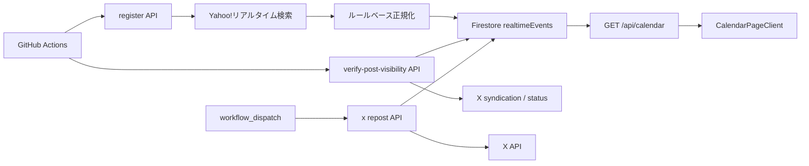

# 謎チケカレンダー / Realtime 設計書

## 位置づけ

この文書は、謎チケカレンダー、Yahoo!リアルタイム検索取得、Firestore 保存、Post 可視性検証、GitHub Actions、X 再投稿をまとめた設計書です。実装の正本は `src/app/(main)/calendar`、`src/components/calendar`、`src/app/api/calendar`、`src/app/api/internal/realtime`、`src/app/api/internal/x`、`src/server/realtime` です。

## 概要

謎チケカレンダーは、対象ハッシュタグの投稿を取得・正規化して Firestore に保存し、公開画面では `realtimeEvents` をカレンダー形式で表示します。収集・削除・可視性検証は GitHub Actions から内部 API を呼び出します。

## 画面

| ルート | 実装 | 役割 |
|---|---|---|
| `/calendar` | `src/app/(main)/calendar/page.tsx` | 画面 entry |
| なし | `src/components/calendar/CalendarPageClient.tsx` | カレンダー表示、検索、詳細ダイアログ |
| なし | `src/hooks/useCalendarData.ts` | `/api/calendar` 取得 |
| なし | `src/components/calendar/EventDetailDialog.tsx` | イベント詳細表示 |

## 公開 API

### `GET /api/calendar`

Firestore の `realtimeEvents` から表示対象イベントを取得します。

| クエリ | 既定値 | 制約 |
|---|---|---|
| `query` | `#謎チケ売ります` | `sourceQuery` と一致するものを取得 |
| `rangeDays` | `28` | 最大 `60` |
| `from` | 今日の 00:00 | 日付として parse できる文字列 |
| `to` | `from + rangeDays` | 指定時はその日の翌日 00:00 未満まで |

最大 500 件を返します。`isRealtimeEventVisible` が false になるイベントはレスポンスから除外します。レスポンスは `Cache-Control: public, max-age=0, s-maxage=300, stale-while-revalidate=300` です。

### `GET /api/realtime`

Yahoo!リアルタイム検索の取得結果を返す公開 API です。現在は取得・確認用の API として残っています。

| クエリ | 内容 |
|---|---|
| `query` | 検索語 |
| `page` | 正の整数 |
| `limit` | 正の整数。上限は `PAGE_SIZE` |

## 内部 API

内部 API は `Authorization: Bearer <REALTIME_INTERNAL_API_TOKEN>` を要求します。

| エンドポイント | 主な body | 役割 |
|---|---|---|
| `POST /api/internal/realtime/register` | `query`, `limit`, `sinceId`, `dryRun` | 投稿を取得・正規化して Firestore に登録 |
| `POST /api/internal/realtime/prune` | `cutoffDays`, `dryRun` | `eventTime` が古いイベントを削除 |
| `POST /api/internal/realtime/verify-post-visibility` | `batchSize`, `maxConcurrency`, `bootstrapScanLimit`, `dryRun` | Post の可視性を検証し syndication fields を更新 |
| `POST /api/internal/x/repost/events` | `hashtag`, `dryRun` | 条件に合うイベントを X で再投稿 |

### 登録 API

既定 `limit` は 20、最大 100 です。実際の fetch limit は Yahoo!リアルタイム検索側の `PAGE_SIZE` も上限になります。

処理:

1. Yahoo!リアルタイム検索から投稿を取得する。
2. `sinceId` があればそれより大きい post id のみ残す。
3. `normalizePost` でイベント情報を抽出する。
4. `eventTime` がない投稿、過去イベント、既存 doc は skipped に入れる。
5. `dryRun=false` のときだけ Firestore に batch set する。

Firestore doc id は `{postId}:{RULESET_VERSION}` です。

### 削除 API

既定 `cutoffDays` は 1、最大 30 です。`eventTime < cutoffDate` の document を最大 20 batch、1 batch 500 件で削除します。

### 可視性検証 API

既定値:

| 項目 | 既定値 | 最大 |
|---|---:|---:|
| `batchSize` | 100 | 200 |
| `maxConcurrency` | 5 | 10 |
| `bootstrapScanLimit` | 500 | 2000 |

`syndicationNextCheckAt <= now` の scheduled candidates を優先し、不足分は active event から bootstrap します。検証結果は `available`、`deleted`、`unknown` に分かれます。

### X 再投稿 API

`lastReviewedAt == null`、指定 hashtag を含む、過去 24 時間に captured された表示可能イベントから候補を選びます。候補がない場合は `204` を返します。実投稿後は対象 document の `lastReviewedAt` を更新します。

## Firestore スキーマ

コレクションは `realtimeEvents` です。

主要フィールド:

| フィールド | 内容 |
|---|---|
| `postId`, `postURL` | 元 Post の識別子と URL |
| `hashtags`, `rawPostText` | 投稿本文由来の情報 |
| `createdAt`, `capturedAt` | 投稿作成時刻、取得時刻 |
| `authorId`, `authorName`, `authorImageUrl` | 投稿者情報 |
| `eventTime`, `eventDateResolution` | 抽出したイベント日時 |
| `ticketTitle`, `category` | チケット名、分類 |
| `price`, `quantity`, `deliveryMethod`, `location` | 抽出した販売条件 |
| `sourceQuery` | 取得元検索語 |
| `normalizationEngine`, `confidence`, `notes`, `needsReview`, `reviewStatus` | 正規化結果とレビュー情報 |
| `lastReviewedAt` | X repost などでレビュー済みにする時刻 |
| `isVisible`, `hiddenReason`, `hiddenAt` | カレンダー表示可否 |
| `syndicationStatus`, `syndicationCheckedAt`, `syndicationNextCheckAt`, `syndicationErrorCount` | Post 可視性検証の状態 |

## GitHub Actions 運用

| Workflow | 起動 | API | Payload |
|---|---|---|---|
| `realtime-register.yml` | 毎時 0 分 | register | `{"query":"#謎チケ売ります","limit":20,"dryRun":false}` |
| `realtime-register-transfer.yml` | 毎時 15 分 | register | `{"query":"#謎チケ譲ります","limit":20,"dryRun":false}` |
| `realtime-register-accompany.yml` | 毎時 30 分 | register | `{"query":"#謎解き同行者募集","limit":20,"dryRun":false}` |
| `realtime-verify-post-visibility.yml` | 毎時 45 分 | verify | `{"batchSize":100,"maxConcurrency":5,"bootstrapScanLimit":500,"dryRun":false}` |
| `realtime-prune.yml` | 毎日 00:15 UTC | prune | `{"cutoffDays":1,"dryRun":false}` |
| `x-repost-events.yml` | 手動実行のみ | x repost | `{"hashtag":"#謎チケ売ります","dryRun":false}` |

Workflow secrets:

- `REALTIME_API_BASE_URL`: サイト origin。例: `https://nazomatic.vercel.app`
- `REALTIME_API_TOKEN`: アプリ側の `REALTIME_INTERNAL_API_TOKEN` と同じ値

## 可視性制御

`/api/calendar` は `isRealtimeEventVisible` を通ったイベントだけ返します。削除済みや非表示化された Post は `isVisible=false`、`hiddenReason`、`hiddenAt` を使ってカレンダーから除外します。

`verify-post-visibility` は取得済みイベントを定期的に確認し、Post が削除済みと判断された場合は `syndicationStatus="deleted"` として非表示化します。判定不能の場合は `unknown` として error count を増やし、次回確認時刻を後ろ倒しします。

## 制約

- Yahoo!リアルタイム検索の HTML / API 仕様変化に影響を受ける。
- Firestore の複合 index は query 追加時に必要になる場合がある。
- `x-repost-events.yml` の自動実行は現在停止中。
- `lastReviewedAt` は X repost 候補の重複防止にも使われるため、別用途で更新すると候補選定に影響する。
