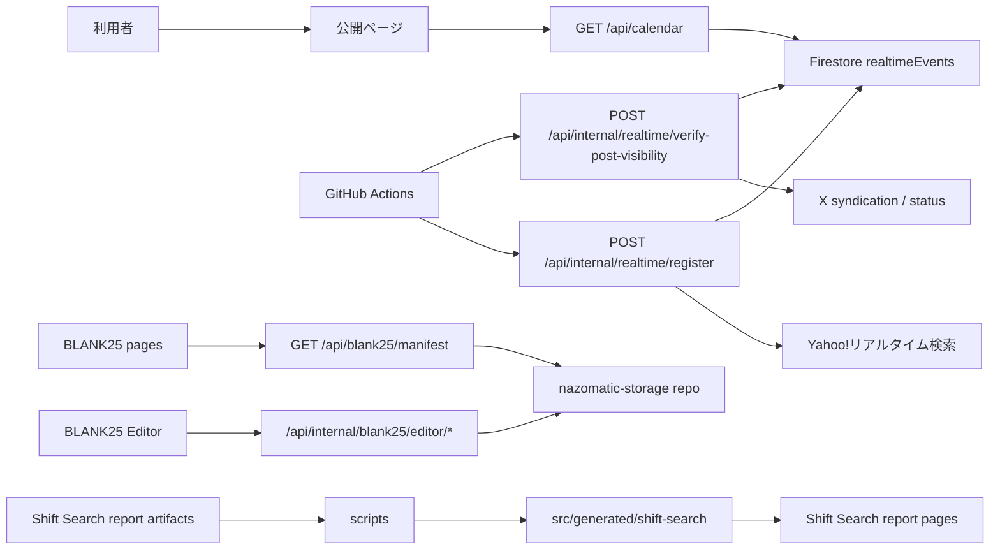

# NAZOMATIC 全体設計書

## 位置づけ

この文書は、NAZOMATIC の全体構造を把握するための設計書です。実装の正本は `src/` 配下のソースコードです。ドキュメントと実装が矛盾した場合は、ソースコードを確認してこの文書を更新します。

## システム概要

NAZOMATIC は、謎解き・パズル支援ツールとイベント補助ツールを 1 つの Next.js アプリにまとめたサイトです。公開ツール、BLANK25、内部 API、管理用 Editor、生成済みレポート表示を同じアプリ内で扱います。

主な利用者は日本語話者の謎解き参加者・制作関係者です。通常の公開ページは検索インデックス対象、BLANK25 と secret 領域は noindex です。

## 技術スタック

| 領域 | 採用技術 |
|---|---|
| アプリケーション | Next.js 14 App Router、React 18、TypeScript |
| UI | Tailwind CSS、shadcn/ui、Radix UI、lucide-react、framer-motion |
| 3D 表示 | react-three/fiber、@react-three/drei、three |
| サーバー処理 | Next.js Route Handler、Firebase Admin SDK |
| 外部連携 | Yahoo!リアルタイム検索、GitHub API、X API、ローカル Playwright |
| 生成・自動化処理 | Node.js scripts、`src/generated/shift-search/` |

## ディレクトリ構成

| パス | 役割 |
|---|---|
| `src/app/(main)` | 公開メイン機能の画面 |
| `src/app/(blank25)` | BLANK25 本体、Editor、パーティ機能 |
| `src/app/(secret)` | noindex の隠しページ |
| `src/app/api` | 公開 API と内部 API |
| `src/components` | 画面・機能コンポーネント |
| `src/lib` | 汎用ロジック、JSON データ、Shift Search ロジック |
| `src/server` | サーバー専用の外部連携・データ操作 |
| `src/types` | API や Firestore データの型 |
| `src/generated/shift-search` | Shift Search レポート表示用の生成済み JSON |
| `artifacts/shift-search/reports` | Shift Search レポートの元成果物 |
| `scripts` | 生成・同期用スクリプト |
| `docs` | 日本語の設計書 |

## ルーティング設計

### 公開メイン領域

`src/app/(main)` は公開ツール群です。`src/app/(main)/layout.tsx` が全体 metadata、OGP、favicon、Google Ad 表示、メインのダークグラデーション背景を持ちます。

| ルート | 主な実装 | 役割 |
|---|---|---|
| `/` | `src/app/(main)/page.tsx` | トップページ。`features.json` をカード一覧に使う |
| `/shiritori` | `src/app/(main)/shiritori/page.tsx` | しりとり最長連鎖探索 |
| `/dice` | `src/app/(main)/dice/page.tsx` | サイコロ展開図と 3D 表示 |
| `/alphabet` | `src/app/(main)/alphabet/page.tsx` | アルファベット・数字変換 |
| `/prefectures` | `src/app/(main)/prefectures/page.tsx` | 都道府県検索 |
| `/graphpaper` | `src/app/(main)/graphpaper/page.tsx` | 方眼紙エディタ |
| `/anagram` | `src/app/(main)/anagram/page.tsx` | 辞書検索 |
| `/calendar` | `src/app/(main)/calendar/page.tsx` | 謎チケカレンダー |
| `/constellation` | `src/app/(main)/constellation/page.tsx` | 星座検索 |
| `/shift-search` | `src/app/(main)/shift-search/page.tsx` | シフト検索 |
| `/character-pick-search` | `src/app/(main)/character-pick-search/page.tsx` | 文字拾い検索 |
| `/shift-search/reports` | `src/app/(main)/shift-search/reports/page.tsx` | Shift Search レポート一覧 |
| `/shift-search/reports/[lang]/[length]` | `src/app/(main)/shift-search/reports/[lang]/[length]/page.tsx` | Shift Search レポート詳細 |

### BLANK25 領域

`src/app/(blank25)` は `robots.index=false` です。公開検索には出さず、直接 URL または内部導線から利用します。

| ルート | 主な実装 | 役割 |
|---|---|---|
| `/blank25` | `src/app/(blank25)/blank25/page.tsx` | 問題一覧 |
| `/blank25/[problemId]` | `src/app/(blank25)/blank25/[problemId]/page.tsx` | 25 パネル推理ゲーム |
| `/blank25/editor` | `src/app/(blank25)/blank25/editor/page.tsx` | Basic 認証付き管理 Editor |
| `/blank25/party` | `src/app/(blank25)/blank25/party/page.tsx` | パーティ得点表示 |
| `/blank25/party/rules` | `src/app/(blank25)/blank25/party/rules/page.tsx` | チーム戦ルール説明 |

詳細は `docs/blank25/design.md` を参照します。

### secret 領域

`src/app/(secret)` は noindex で、通常導線に載せないページを扱います。`robots.ts` でも `/secret/` を disallow しています。

| ルート | 役割 |
|---|---|
| `/secret/christmas` | 隠しページ |
| `/secret/christmas/congratulations` | 隠しページ |
| `/secret/ponpoppo/[productId]` | `public/data/quiz-data.json` を読むクイズページ |

## API 設計

API は `src/app/api` に集約します。外部データ取得や永続化はクライアントから直接行わず、Route Handler またはサーバー専用モジュールを経由します。

| エンドポイント | 認証 | 主な実装 | 役割 |
|---|---|---|---|
| `GET /api/realtime` | なし | `src/app/api/realtime/route.ts` | Yahoo!リアルタイム検索の取得結果を返す公開 API |
| `GET /api/calendar` | なし | `src/app/api/calendar/route.ts` | Firestore の `realtimeEvents` をカレンダー表示用に返す |
| `GET /api/blank25/manifest` | なし | `src/app/api/blank25/manifest/route.ts` | BLANK25 storage の `problems.json` を検証して返す |
| `GET /api/internal/blank25/editor/manifest` | Basic | `src/app/api/internal/blank25/editor/manifest/route.ts` | Editor 用 manifest 読み込み |
| `POST /api/internal/blank25/editor/publish` | Basic | `src/app/api/internal/blank25/editor/publish/route.ts` | BLANK25 問題の作成・更新・削除を storage repo に反映 |
| `POST /api/internal/realtime/register` | Bearer | `src/app/api/internal/realtime/register/route.ts` | Yahoo!リアルタイム検索を取得・正規化して Firestore に登録 |
| `POST /api/internal/realtime/prune` | Bearer | `src/app/api/internal/realtime/prune/route.ts` | 古い `realtimeEvents` を削除 |
| `POST /api/internal/realtime/verify-post-visibility` | Bearer | `src/app/api/internal/realtime/verify-post-visibility/route.ts` | X Post の syndication 状態を確認し可視性を更新 |
| `POST /api/internal/x/repost/events` | Bearer | `src/app/api/internal/x/repost/events/route.ts` | 条件に合うイベントを X で再投稿 |
| `POST /api/internal/x/browser-post/events/prepare` | Bearer | `src/app/api/internal/x/browser-post/events/prepare/route.ts` | ローカルブラウザ投稿用の候補予約 |
| `POST /api/internal/x/browser-post/events/confirm` | Bearer | `src/app/api/internal/x/browser-post/events/confirm/route.ts` | ローカルブラウザ投稿結果の DB 反映 |

内部 Realtime / X API は `Authorization: Bearer <REALTIME_INTERNAL_API_TOKEN>` を要求します。BLANK25 Editor API は `src/middleware.ts` の Basic 認証と mutation method の Origin チェックで保護します。

X API を使わずローカルブラウザセッションで投稿する機能は、候補予約と DB 更新だけを内部 API に置き、投稿操作そのものはローカル Playwright CLI で行います。要件とリスクは `docs/x-browser-posting/design.md` に分けます。

## データ境界

| データ | 正本 | 読み書き |
|---|---|---|
| 公開ツール一覧 | `src/lib/json/features.json` | トップページ、ヘッダー、JSON-LD、sitemap が参照 |
| 辞書データ | `public/dic/*.dic` | `SearchManager` がクライアントから読み込み |
| 星座データ | `src/lib/json/constellations-data.json` | 星座検索が参照 |
| Realtime イベント | Firestore `realtimeEvents` | 内部 API が書き込み、`/api/calendar` が読み込み |
| BLANK25 問題 | 外部 `nazomatic-storage` repo の `problems.json` / `img/*` | API 経由で raw URL から読み込み、Editor が GitHub API で書き込み |
| Shift Search レポート | `artifacts/shift-search/reports` | scripts で `src/generated/shift-search` に同期 |
| BLANK25 プレイ状態 | ブラウザ `localStorage` | ゲーム画面とパーティ得点表示が利用 |

## `features.json` の扱い

`src/lib/json/features.json` は公開メイン機能の導線に関する単一ソースです。配列順も仕様です。

利用箇所:

- トップページのカード一覧
- ヘッダー / モバイルナビ
- `sitemap.ts` の URL 列挙
- `json-ld-component.tsx` の `Article` 参照

新しい公開ページをメイン導線に載せる場合は `features.json` を更新します。`/blank25`、`/shift-search/reports`、secret ページは通常導線の対象外です。

## SEO とクロール制御

| 対象 | 設定 |
|---|---|
| `(main)` | `robots.index=true`、OGP / Twitter / favicon / manifest を設定 |
| `(blank25)` | `robots.index=false`、`follow=true` |
| `(secret)` | `robots.index=false`、`follow=true` |
| `robots.ts` | `/api/` と `/secret/` を disallow |
| `sitemap.ts` | `/` と `features.json` の path のみ出力 |

## 生成物設計

Shift Search の大量レポートは、元成果物とアプリ表示用 assets を分けます。

| 種別 | パス | 役割 |
|---|---|---|
| 元成果物 | `artifacts/shift-search/reports` | Markdown レポート、index、manifest、外部リンク定義 |
| 表示用 assets | `src/generated/shift-search` | Next.js が import する JSON |
| 同期スクリプト | `scripts/build-shift-search-report-meta.mjs` | 元成果物の manifest / index を生成 |
| 同期スクリプト | `scripts/build-shift-search-view-assets.mjs` | 表示用 JSON を生成 |

詳細は `docs/shift-search/design.md` を参照します。

## 認証・保護境界

| 対象 | 保護方式 |
|---|---|
| `/blank25/editor/*` | `BLANK25_EDITOR_USER` / `BLANK25_EDITOR_PASSWORD` による HTTP Basic 認証 |
| `/api/internal/blank25/editor/*` | 同じ Basic 認証。POST / PUT / PATCH / DELETE は Origin も確認 |
| `/api/internal/realtime/*` | `REALTIME_INTERNAL_API_TOKEN` の Bearer 認証 |
| `/api/internal/x/repost/events` | `REALTIME_INTERNAL_API_TOKEN` の Bearer 認証 |
| `/api/internal/x/browser-post/*` | `REALTIME_INTERNAL_API_TOKEN` の Bearer 認証 |

## 全体データフロー

## 関連設計書

- 開発・環境変数・検証: `docs/development-guide.md`
- 公開メインツール: `docs/public-tools/design.md`
- BLANK25: `docs/blank25/design.md`
- 謎チケカレンダー / Realtime: `docs/calendar-realtime/design.md`
- X ブラウザ投稿自動化: `docs/x-browser-posting/design.md`
- Shift Search: `docs/shift-search/design.md`
- 文字拾い検索: `docs/character-pick-search/design.md`
- AI 実装ルール: `docs/ai-coding-rules.md`
