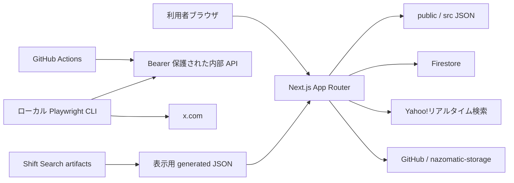

# NAZOMATIC システム設計書

このフォルダは、現行コードから確認できるシステム設計の正本です。将来計画、実装経緯、完了済み作業は扱いません。

## システムの要約

NAZOMATIC は、謎解き・パズル支援ツール、イベント情報カレンダー、BLANK25、生成済み探索レポート、X 投稿支援を 1 つの Next.js App Router アプリで提供します。公開画面、noindex 画面、Route Handler、サーバー専用外部連携、ローカル CLI が同じリポジトリにあります。

## 文書構成

### Architecture

| 文書 | 内容 |
|---|---|
| [`architecture/overview.md`](./architecture/overview.md) | 技術構成、実行境界、ディレクトリ責務 |
| [`architecture/routes-and-apis.md`](./architecture/routes-and-apis.md) | 画面ルート、API、SEO 対象 |
| [`architecture/data-and-security.md`](./architecture/data-and-security.md) | 正本データ、永続化、外部連携、認証境界 |

### Subsystems

| 文書 | 内容 |
|---|---|
| [`subsystems/public-tools.md`](./subsystems/public-tools.md) | 公開ツール、辞書、文字拾い検索 |
| [`subsystems/calendar-realtime.md`](./subsystems/calendar-realtime.md) | カレンダー、Realtime 収集、可視性検証 |
| [`subsystems/blank25.md`](./subsystems/blank25.md) | BLANK25、Editor、外部 storage |
| [`subsystems/shift-search.md`](./subsystems/shift-search.md) | シフト検索とレポート配信 |
| [`subsystems/x-posting.md`](./subsystems/x-posting.md) | X API 再投稿とローカルブラウザ投稿 |

### Operations / Quality

| 文書 | 内容 |
|---|---|
| [`operations/jobs-and-generated-assets.md`](./operations/jobs-and-generated-assets.md) | GitHub Actions、ローカル CLI、生成物同期 |
| [`operations/x-browser-post-schedules.md`](./operations/x-browser-post-schedules.md) | 稼働中の X ブラウザ投稿スケジュールと実行契約 |
| [`quality/known-concerns.md`](./quality/known-concerns.md) | 現行コードから確認できる懸念点と影響 |

## 設計上の不変条件

- 公開導線の順序と列挙は `src/lib/json/features.json` を正本にする。
- 外部データ取得と永続化はサーバーまたはローカル CLI に閉じ、クライアントは `/api/*` を使う。
- BLANK25 Editor は HTTP Basic 認証、Realtime / X 内部 API は Bearer 認証を使う。
- 通常 UI はダークグラデーションと `purple-400` を基調にする。
- text-like input はモバイルで 16px 以上にする。
- Shift Search の元成果物と表示用 JSON は分離し、生成コマンドで同期する。
