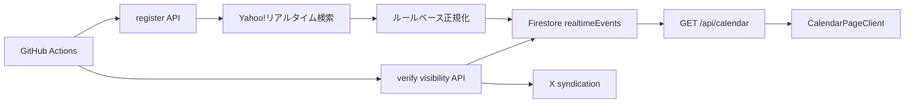

# 謎チケカレンダーと Realtime

## 構成

日付境界、今日判定、月移動、イベント集約は `Asia/Tokyo` を基準とし、実行環境のローカル timezone には依存しません。

## 収集と正規化

`POST /api/internal/realtime/register` は次の順で処理します。

1. `fetchYahooRealtimePosts()` で対象 query の Post を取得する。
2. `sinceId` がある場合は新しい Post だけを残す。
3. `normalizePost()` でイベント日時、タイトル、価格などを抽出する。
4. 日時なし、過去イベント、同一 document id を除外する。
5. `dryRun=false` の場合だけ batch write する。

既定 limit は 20、API 上限は 100、Yahoo 取得の実効上限は 40 です。正規化ルールの version は `RULESET_VERSION` に含め、Firestore document id を `{postId}:{RULESET_VERSION}` とします。

## 公開カレンダー

`GET /api/calendar` は `eventTime` と `sourceQuery` で絞り、最大 500 件を時刻昇順で返します。`isRealtimeEventVisible()` が false の document は除外します。

画面は `useCalendarData.ts` から API を呼び、`CalendarPageClient.tsx` が月表示、検索、再取得、詳細 dialog を管理します。

## 可視性検証

`verify-post-visibility` は、確認時刻に達した document を優先し、不足分を active event から補います。X syndication の確認結果を次の状態へ正規化します。

| 状態 | 扱い |
|---|---|
| `available` | 表示を継続し、次回確認時刻を更新 |
| `deleted` | 非表示にし、hidden fields を更新 |
| `unknown` | error count と再確認時刻を更新 |

既定 batch size は 10、同時実行は 5、bootstrap scan は 50 です。

## 削除

`POST /api/internal/realtime/prune` は `eventTime` が cutoff より古い document を削除します。既定 cutoff は 1 日、最大 30 日、1 batch 500 件、最大 20 batch です。

## X 連携との共有

- X API Repost と個別ブラウザ投稿は `lastReviewedAt` を候補重複防止に使う。
- 個別ブラウザ投稿は `xBrowserPost` を document に保存する。
- 週末サマリは `realtimeEvents` を集計するが、各 document を更新しない。
- トレンドネタ投稿は Firestore を読まず、Yahoo 検索結果をメモリ上で使う。

## 外部仕様への依存

- Yahoo!リアルタイム検索の response 形式。
- X syndication endpoint の可用性と response 形式。
- Firestore query に必要な index。

これらの変更は、収集停止、可視性の `unknown` 増加、API エラーとして現れます。
