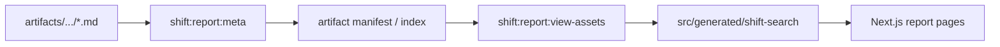

# Shift Search

## 対話検索

`runShiftSearch()` が入力語を正規化し、各 shift の完全一致と任意のアナグラム一致を辞書から探します。

| 種別 | 文字集合 | shift 数 |
|---|---|---:|
| 英語 | `a-z` | 25 |
| 日本語 | ひらがな 46 字から「ゐ」「ゑ」を除く | 45 |

英語は NFKC と小文字化、日本語はカタカナのひらがな化、小書き文字の正規化、濁点・半濁点の分離と再付与を行います。

| 上限 | 値 |
|---|---:|
| 完全一致 | 1,000 |
| アナグラム | 3,000 |
| 合計 | 5,000 |

結果は shift 昇順、完全一致優先、単語昇順で重複排除します。

## レポート配信

全探索レポートは元成果物と Web 表示用 JSON を分けます。



| 種別 | パス |
|---|---|
| 元 Markdown | `artifacts/shift-search/reports/{jp|en}` |
| 元 manifest / index | `artifacts/shift-search/reports/shift-search-report-*` |
| 外部 URL 定義 | `artifacts/shift-search/reports/shift-search-external-links.json` |
| 表示 manifest | `src/generated/shift-search/view-manifest.json` |
| 内部本文 | `src/generated/shift-search/internal/{lang}-{length}.json` |

`EXTERNAL_THRESHOLD=3000` 行以上を external とします。

- internal: 本文 JSON をアプリへ同梱し、詳細 page で表示する。
- external + URL あり: 一覧から外部 URL へ遷移する。
- external + URL なし: 詳細 page で raw GitHub Markdown の取得導線を表示する。

詳細 page の static params は表示 manifest の全 report から生成し、`dynamicParams=false` です。internal は本文を表示し、external は配信先または raw Markdown の取得導線を表示します。

## 更新時の一貫性

元成果物を変更したら、次を順に実行し、artifacts と generated を同じ commit に含めます。

```bash
npm run shift:report:meta
npm run shift:report:view-assets
```
