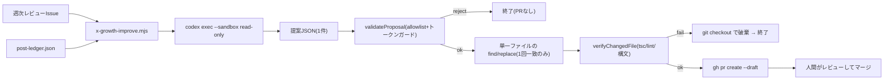

# X 週次改善エージェント

## 目的

週次改善レビュー（`x:growth-review`）の結果をもとに、次週に試す X 運用の改善実験を **1件だけ** 選び、変更のドラフト PR を自動生成する。フォロワー増加に向けた「レビュー → 実験 → 計測 → 検証」ループの実験提案側を担う。判断と採用（マージ）は人間が行う。

`npm run x:growth-improve` で実行する。既定は dry-run（提案の生成・検証まで）で、`--execute` を付けるとドラフト PR まで作成する。

## 安全設計

LLM に書き込み権限を渡さないことが核。codex は読み取り専用で「提案」を出すだけで、破壊的操作はすべて決定論的な Node コードが担う。

- **codex は read-only**: `codex exec --cd <repo> --sandbox read-only --ephemeral --output-schema <schema> --output-last-message <out> -`。トレンドジョークの provider と同じ呼び出し流儀。
- **提案は構造化 JSON**: `hypothesis` / `path` / `kind` / `change{find,replace}` / `metric` / `evaluateWeek` / `rationale`。
- **allowlist で編集先を固定**（`scripts/x-growth/experimentAllowlist.mjs`）。
- **ts-copy のファイル内トークンガード**: `.ts` の変更が投稿ロジック・validator・認証・実行ガード・外部呼び出しの重要トークンに触れる提案は拒否（大小文字無視）。
- **適用後の検証ゲート**（`scripts/x-growth/verifyChange.mjs`）: `.ts` は `tsc --noEmit` と `npm run lint`、`.mjs` は `node --check`、`.json` は `JSON.parse`。失敗したら `git checkout -- <path>` で破棄し PR を作らない。
- **1 PR = 1実験 = 1ファイル = ちょうど1回一致する find/replace**。revert で完結。**自動マージはしない**。

## allowlist（編集可能パス）

| パス | kind | 内容 |
|---|---|---|
| `src/server/x-browser-posting/comment-patterns.json` | `json-array` | 個別イベント投稿のコメント候補 |
| `src/server/x-browser-posting/trend-joke-post.ts` | `ts-copy` | fallback 候補文・prompt テンプレート・閾値定数（文言と数値のみ。ロジック不可） |
| `docs/system-design/operations/x-browser-post-schedules.md` | `doc` | 運用台帳の記述更新 |

**禁止（Node が拒否）**: `scripts/x-browser-posting/config.mjs`、`.env*`、`.github/`、`middleware.*`、`package(-lock).json`、rate limit・`--execute`・confirmation に関わる全て、複数ファイル同時変更、新規ファイル作成。

## 構成ファイル

| 実装 | 責務 |
|---|---|
| `scripts/x-growth-improve.mjs` | エントリ。レビュー取得・台帳サマリ・codex 呼び出し・オーケストレーション |
| `scripts/x-growth/experimentAllowlist.mjs` | 編集可能パスと ts-copy 変更トークンの allowlist・検証 |
| `scripts/x-growth/proposalSchema.mjs` | codex `--output-schema` 用スキーマと提案バリデータ |
| `scripts/x-growth/applyProposal.mjs` | 単一ファイルの find/replace 適用（1回一致のみ）とドラフト PR 作成 |
| `scripts/x-growth/verifyChange.mjs` | 適用後の検証ゲートと `git checkout` による破棄 |

## 実験台帳と勝敗の検証

ドラフト PR を作成すると、`recordExperiment` が `local/x-browser-posting/experiment-ledger.json` に実験を `open` で記録します（仮説・対象・種別・指標・評価予定週・PR URL・開始時の台帳サマリ）。翌週以降、週次改善レビューの「実験の勝敗」節が、今週が評価予定週の open 実験を一覧し、次元別比較と開始時を見比べた継続 / revert を提示します。**自動 revert はしません。** 人間が判断し、`resolveExperiment` で `kept` / `reverted` を記録します。これでレビュー → 実験 → 計測 → 検証が1週サイクルで閉じます。

| 実装 | 責務 |
|---|---|
| `scripts/x-growth/experimentLedger.mjs` | 実験の記録・読み出し・解決（open / kept / reverted） |

## 実行と失敗時の挙動

- 提案が allowlist・トークンガード・スキーマ・ちょうど1回一致・検証ゲートのいずれかを満たさない場合は `rejected` として理由を表示し、PR を作らずに正常終了する。
- ログは `logs/x-growth-improve/` に世代管理で残す。
- Codex automation への枠登録（毎週月曜 12:00 想定）は運用者が行う。登録するまで自動実行はされない。

## 関連

- [`x-posting.md`](./x-posting.md) — 投稿と週次レビューの本体
- [`../operations/x-browser-post-schedules.md`](../operations/x-browser-post-schedules.md) — 稼働スケジュールと実行契約
