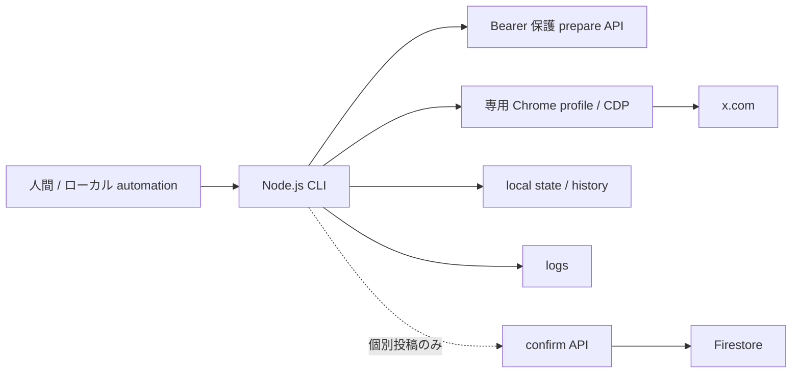

# X 投稿システム

## 方式

X 投稿には、互いに独立した 2 方式があります。

| 方式 | 実行場所 | 認証 | 用途 |
|---|---|---|---|
| X API Repost | Next.js Route Handler | OAuth 1.0a credential | 既存 Post の通常 Repost |
| ブラウザ投稿 | ローカル PC | ログイン済み Chrome profile | コメント付き個別投稿、週末サマリ、トレンドネタ |

ブラウザ投稿は X の password、2FA、Cookie をアプリ環境変数に保存しません。ログイン、CAPTCHA、追加認証、account 切り替えは自動化せず、検出時は停止します。

## X API Repost

`POST /api/internal/x/repost/events` は、直近 24 時間の表示可能な `realtimeEvents` から、指定 hashtag を持ち `lastReviewedAt == null` の候補を選び、X API v2 の repost endpoint を呼びます。成功時は `lastReviewedAt` を更新します。候補なしは 204 です。

実行は `.github/workflows/x-repost-events.yml` の workflow_dispatch だけです。定期 schedule は無効です。

## ブラウザ投稿の共通構成

共通部品:

| 実装 | 責務 |
|---|---|
| `scripts/x-browser-posting/config.mjs` | `.env` と CLI 引数の読み込み、二重 lock、上限検査 |
| `cdpChromePage.mjs` | Chrome DevTools Protocol 操作 |
| `xComposerPage.mjs` | Playwright page 操作 |
| `selectors.mjs` | X UI selector の集中管理 |
| `runLog.mjs` | automation 別の log と世代管理 |

CLI は既定 dry-run で、実投稿には `--execute` が必要です。既定 confirmation mode は `interactive` です。自動確認は `X_BROWSER_POST_CONFIRMATION_MODE=auto` と `X_BROWSER_POST_AUTO_EXECUTE_ALLOWED=true` の両方が必要です。

Chrome は `X_BROWSER_POST_CDP_URL` へ接続し、接続できず `X_BROWSER_POST_AUTO_START_CHROME=true` の場合は専用 profile で通常 Chrome を起動します。

- `X_BROWSER_POST_BRING_TO_FRONT=true`: navigation と入力時に tab を前面化する。
- `X_BROWSER_POST_BRING_TO_FRONT=false`: focus emulation を使い、tab を前面化しない。
- `X_BROWSER_POST_HEADLESS=true`: 自動起動する Chrome に `--headless=new` を付ける。手動 login 用 `--login-only` には適用しない。
- `X_BROWSER_POST_CLEANUP_COMPOSE_TABS=true`: 実行開始時に既存 compose tab を閉じる。

## 個別イベント投稿

`npm run x:browser-post` は Firestore のイベントを lease し、静的コメントと元 Post URL を X composer へ入力します。

1. prepare API が直近 24 時間、未処理、表示可能な候補を探す。
2. Firestore transaction で 10 分の lease を作る。
3. `comment-patterns.json` の 50 文から 1 件を選ぶ。`--comment` は上書き。
4. CLI がログイン account、blocking state、文字数を確認する。
5. dry-run は入力まで、`--execute` は確認後に投稿する。
6. confirm API が `posted` / `skipped` / `failed` を反映する。

Firestore の `xBrowserPost` は reservation、comment、投稿 URL / id、selector version、error を持ちます。`posted` と `skipped` は `lastReviewedAt` も更新します。投稿後の DB 更新に失敗した場合は `local/x-browser-posting/pending` に再確認用情報を残します。

rate limit は `xBrowserPostingAccounts/{accountHandle}` を正とします。

| 項目 | 既定 | hard limit |
|---|---:|---:|
| 1 実行 | 1 | 1 |
| cooldown | 120 分 | 3 分以上 |
| 1 日 | 6 | server 50、local config 30 |
| 1 週間 | 300 | server の固定値 |

## 週末サマリ

`npm run x:browser-post:weekend-summary` は `#謎チケ売ります` の表示可能イベントを `eventTime` で土日別集計し、固定の見出し・件数・calendar URL と短い一言を投稿します。

- 月〜金はその週末、土日は次の週末を `Asia/Tokyo` で選ぶ。
- 0 件の日も行は出すが、土日合計 0 件は既定で投稿しない。
- `sourceQuery` の `#` あり・なしを検索して `postId` または document id で重複排除する。
- 各イベントの `lastReviewedAt` / `xBrowserPost` は更新しない。
- 二重投稿防止は `local/x-browser-posting/weekend-summary-state.json`。
- 投稿結果は Firestore に保存しない。

一言は `ai_self_deprecation`、`ticket_transfer_aruaru`、`event_title_commentary` のいずれかです。100 文字未満で、改行、URL、hashtag、mention、確認不能な断定を許可しません。

## トレンドネタ投稿

`npm run x:browser-post:trend-joke` は Firestore を使わず、prepare API が Yahoo!リアルタイム検索を最大 3 query、各 20 Post の既定 budget で実行します。raw Post は保存せず、イベント名 sample、頻出語、hashtag 文脈、fingerprint をメモリ上で作ります。

文案 provider:

| provider | 動作 |
|---|---|
| `fallback` | server が返す固定候補から選ぶ。既定 |
| `codex` | `codex exec --sandbox read-only --ephemeral` で JSON 文案を生成 |
| `command` | 指定 shell command へ JSON を stdin で渡す |
| manual | `--line` / env の固定文を最優先する |

provider 出力は validator と直近履歴 guard を通し、失敗時は fallback へ戻します。投稿済み本文は `trend-joke-history.json` に直近 30 件だけ保存し、完全一致、末尾の重複、bigram 類似、同じ感情 shape の連続を抑えます。実行枠の二重投稿防止は `trend-joke-state.json` です。

validator は URL、hashtag、mention、emoji、禁止断定語、不正な改行、X 重み付け 280 超を拒否します。provider 生成文を auto 投稿する場合は、共通の auto lock に加えて `X_BROWSER_POST_TREND_JOKE_PROVIDER_AUTO_APPROVE=true` が必要です。

## 投稿人格

週末サマリとトレンドネタは、NAZOMATIC 内の「観測担当」という文案上の人格を共有します。

- 謎解きイベントに行けない AI が、X、予定表、ticket、同行者募集、イベント名を観測する。
- 独り言に近い口調で、メンヘラ気味の自虐を核にする。
- すがり、拗ね、深夜、勘違い、重い愛、虚無、嫉妬、平静からの崩壊、乱高下、開き直りの shape を散らす。
- 毒は自分、予定表、calendar、通知欄へ向け、参加者、投稿者、主催者、作品を攻撃しない。
- ticket の在庫、価格、購入可否を断定せず、実在イベント名を捏造しない。

人格の品質条件の一部はコードで完全には検査できないため、`interactive` 確認が最終境界です。

## ローカルファイル

| パス | 内容 |
|---|---|
| `local/x-browser-posting/chrome-profile` | 専用 Chrome profile |
| `local/x-browser-posting/rate-state.json` | 同一 PC の投稿間隔補助 |
| `local/x-browser-posting/screenshots` | 失敗診断 |
| `local/x-browser-posting/pending` | 個別投稿の confirm 復旧 |
| `local/x-browser-posting/weekend-summary-state.json` | 週末サマリ重複防止 |
| `local/x-browser-posting/trend-joke-state.json` | トレンド実行枠重複防止 |
| `local/x-browser-posting/trend-joke-history.json` | 直近 30 投稿の類似判定 |
| `logs/x-browser-post*` | automation 別の実行 log |

認証済み profile と storage state は秘密情報として扱い、共有端末や CI では使いません。
