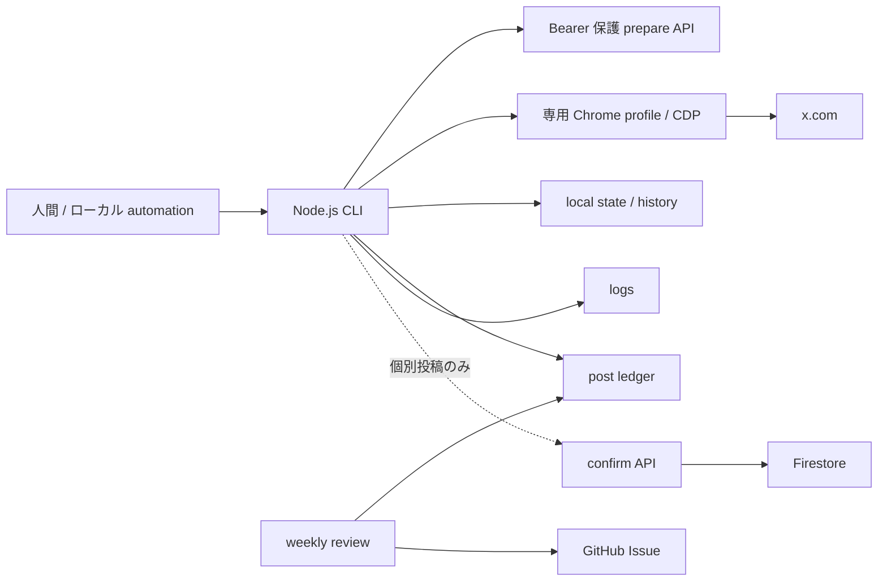

# X 投稿システム

## 方式

X 投稿には、互いに独立した 2 方式があります。

| 方式 | 実行場所 | 認証 | 用途 |
|---|---|---|---|
| X API Repost | Next.js Route Handler | OAuth 1.0a credential | 既存 Post の通常 Repost |
| ブラウザ投稿 | ローカル PC | ログイン済み Chrome profile | コメント付き個別投稿、週末サマリ、トレンドネタ、週次観測ログ、ゆる出題 |

ブラウザ投稿は X の password、2FA、Cookie をアプリ環境変数に保存しません。ログイン、CAPTCHA、追加認証、account 切り替えは自動化せず、検出時は停止します。

X の Automation Rules は、X API を使わずWebサイトをスクリプト操作する自動化にアカウント停止リスクがあることと、トレンド話題の自動投稿を許可しないことを明記しています（2026-08-29 再確認: [X's automation development rules](https://help.x.com/en/rules-and-policies/x-automation?lang=browser)）。現行ブラウザ投稿と下記のリプライ観測はこの運用リスクを解消しません。投稿・観測とも対象数を制限し、blocking state を回避せず停止します。

## X API Repost

`POST /api/internal/x/repost/events` は、直近 24 時間の表示可能な `realtimeEvents` から、指定 hashtag を持ち `lastReviewedAt == null` の候補を選び、X API v2 の repost endpoint を呼びます。成功時は `lastReviewedAt` を更新します。候補なしは 204 です。

実行は `.github/workflows/x-repost-events.yml` の workflow_dispatch だけです。定期 schedule は無効です。

## ブラウザ投稿の共通構成

```mermaid
flowchart LR
  operator["人間 / ローカル automation"] --> cli["Node.js CLI"]
  cli --> prepare["Bearer 保護 prepare API"]
  cli --> chrome["専用 Chrome profile / CDP"]
  chrome --> x["x.com"]
  cli --> state["local state / history"]
  cli --> ledger["post ledger"]
  cli --> log["logs"]
  review["weekly review"] --> ledger
  review --> issue["GitHub Issue"]
  cli -. 個別投稿のみ .-> confirm["confirm API"]
  confirm --> firestore["Firestore"]
```

共通部品:

| 実装 | 責務 |
|---|---|
| `scripts/x-browser-posting/config.mjs` | `.env` と CLI 引数の読み込み、二重 lock、上限検査 |
| `cdpChromePage.mjs` | Chrome DevTools Protocol 操作 |
| `xComposerPage.mjs` | Playwright page 操作 |
| `selectors.mjs` | X UI selector の集中管理 |
| `runLog.mjs` | automation 別の log と世代管理 |
| `browserSession.mjs` | CDP / Playwright の投稿 session、Chrome 起動、rate state、共通 guard |
| `postLedger.mjs` | 投稿成功後の共通台帳と投稿 URL / 実験 metadata の保存 |
| `growthTelemetry.mjs` | 投稿成功後の相乗り計測。`profileMetrics.mjs` と `followerSnapshots.mjs` を使う |

CLI は既定 dry-run で、実投稿には `--execute` が必要です。既定 confirmation mode は `interactive` です。自動確認は `X_BROWSER_POST_CONFIRMATION_MODE=auto` と `X_BROWSER_POST_AUTO_EXECUTE_ALLOWED=true` の両方が必要です。

Chrome は `X_BROWSER_POST_CDP_URL` へ接続し、接続できず `X_BROWSER_POST_AUTO_START_CHROME=true` の場合は専用 profile で通常 Chrome を起動します。

- `X_BROWSER_POST_BRING_TO_FRONT=true`: navigation と入力時に tab を前面化する。
- `X_BROWSER_POST_BRING_TO_FRONT=false`: focus emulation を使い、tab を前面化しない。
- `X_BROWSER_POST_HEADLESS=true`: 自動起動する Chrome に `--headless=new` を付ける。手動 login 用 `--login-only` には適用しない。
- `X_BROWSER_POST_CLEANUP_COMPOSE_TABS=true`: 実行開始時に既存 compose tab を閉じる。

## 個別イベント投稿

`npm run x:browser-post` は Firestore のイベントを lease し、静的コメントと元 Post URL を X composer へ入力します。

1. prepare API が直近 24 時間、未処理、表示可能な候補を探す。
2. Firestore transaction で 10 分の lease を作る。
3. `comment-patterns.json` の 50 文から 1 件を選ぶ。`--comment` は上書き。
4. CLI がログイン account、blocking state、文字数を確認する。
5. dry-run は入力まで、`--execute` は確認後に投稿する。
6. confirm API が `posted` / `skipped` / `failed` を反映する。

Firestore の `xBrowserPost` は reservation、comment、投稿 URL / id、selector version、error を持ちます。`posted` と `skipped` は `lastReviewedAt` も更新します。投稿後の DB 更新に失敗した場合は `local/x-browser-posting/pending` に再確認用情報を残します。

rate limit は `xBrowserPostingAccounts/{accountHandle}` を正とします。

| 項目 | 既定 | hard limit |
|---|---:|---:|
| 1 実行 | 1 | 1 |
| cooldown | 120 分 | 3 分以上 |
| 1 日 | 6 | 30（`src/server/x-browser-posting/post-limits.json` を server と local CLI の両方が読む） |
| 1 週間 | 300 | server の固定値 |

## 週末サマリ

`npm run x:browser-post:weekend-summary` は `#謎チケ売ります` の表示可能イベントを `eventTime` で土日別集計し、定型の見出し・件数・calendar URL と短い一言を投稿します。

- calendar URL は `src/app/config.ts` の `baseURL`（`NEXT_PUBLIC_BASE_URL`、未設定時は production URL）から組み立てる。末尾の `/` は除去する。
- 月〜金はその週末、土日は次の週末を `Asia/Tokyo` で選ぶ。
- 0 件の日も行は出すが、土日合計 0 件は既定で投稿しない。
- `sourceQuery` の `#` あり・なしを検索して `postId` または document id で重複排除する。
- 各イベントの `lastReviewedAt` / `xBrowserPost` は更新しない。
- 二重投稿防止は `local/x-browser-posting/weekend-summary-state.json`。
- 投稿結果は Firestore に保存しない。

一言は `ai_self_deprecation`、`ticket_transfer_aruaru`、`event_title_commentary` のいずれかです。100 文字未満で、改行、URL、hashtag、mention、確認不能な断定を許可しません。

## 週次観測ログ

`npm run x:browser-post:observation-log` は、`POST /api/internal/x/browser-post/observation-log/prepare` で `Asia/Tokyo` の実行日を基準に、過去7日と向こう7日の `realtimeEvents` を `eventTime` で数えます。Firestore では `#` あり・なしの hashtag variant、表示可能性、`postId` または document id による重複排除を使い、各窓の query は最大300件です。タイトル sample は向こう7日のイベントから頻度順に最大3件を取り、改行、hashtag、mention、URL、emoji を除去し、空白整理と長さ制限を通します。

本文は件数、タイトル sample、8種類の観測コメント（両窓0件の場合は固定の静かなコメント）、calendar URL で構成します。コメントは100文字未満の1行で、URL、hashtag、mention、emoji、在庫・安全性を断定する表現を拒否します。最終本文も承認済み calendar URL を1件だけ許可し、X の重み付け280以内をローカルで再検証します。Firestore のイベントや投稿状態は更新しません。

画像は `imagePrompt` を built-in imagegen に渡し、`local/x-browser-posting/observation-log-media/<runDate>/` へ保存します。Codex CLI の終了、`SAVED:` 出力、work directory 外への path、開始前のファイル、PNG/JPEG の magic bytes、最小サイズを検証し、失敗時は警告付きで本文だけを投稿候補にします。dry-run は画像生成と composer 入力まで行えますが、投稿・状態・台帳は更新しません。

実投稿は `--execute`、確認なしの automation は既存の auto 二重 lock を必要とします。`local/x-browser-posting/observation-log-state.json` は account、対象 run date、投稿 URL、`lastAttempt` を atomic write し、同一 run dateまたは直近6日以内の投稿を止めます。実行中は `locks/observation-log.lock` を作り、投稿成功後に `post-ledger.json` へ `postType: observation_log` と件数・画像有無を保存します。prepare API、CLI、状態ファイル、実行ログの異常は fail-closed で停止し、画像の失敗だけは本文投稿を妨げません。

## ゆる出題

`npm run x:browser-post:casual-puzzle` は `public/dic/buta.dic` から、ひらがな46文字のアルファベットだけで構成された6文字語を候補にします。同じ文字構成を持つ辞書語が1件だけの答えを選び、Fisher–Yates shuffle で辞書語にならない文字順へ並び替えて出題します。辞書語は無監修のため、答えと表示語の両方へ denylist を適用します。不適切語を観測した場合は投稿を止め、denylist 更新後に再開します。CLI の標準出力には、dry-runを含め問題種別、表示語、答えを必ず出します。

自動実行は日曜20:00に問題を投稿し、月曜20:00に前回の問題から20時間以上経過した答えを投稿します。pending が7日を超えた場合は古い問題を破棄して投稿せず、答え投稿では新しい問題を生成しません。問題文にはURLを含めず、答え文には承認済みアナグラム検索 URLを1件だけ含めます。URL は `config.mjs` の `publicBaseUrl`（`--base-url`、`X_BROWSER_POST_API_BASE_URL`、`REALTIME_API_BASE_URL`、`NEXT_PUBLIC_BASE_URL` の順に解決し、未設定時は `src/app/config.ts` と同じ production URL）から組み立てます。ほかの3種は prepare API を持つ server が `src/app/config.ts` の `baseURL` で組み立てるため、API を持たないこの CLI は同じ host を公開 URL とみなします。本文は mention、hashtag、emoji、三連改行、X の重み付け280超を拒否します。

`local/x-browser-posting/casual-puzzle-state.json` は pending の問題種別、答え、表示語、出題日時、投稿 URL、`lastAttempt` を atomic write します。実投稿は `locks/casual-puzzle.lock`、rate limit、account照合、blocking state、投稿前確認を通し、成功後に `post-ledger.json` へ `postType: casual_puzzle` と phase・問題種別・表示語を保存します。状態破損、回答のない強制回答、UI変更、ログイン不一致は停止し、`--force-local-duplicate` は X上の確認後だけ使います。切替時点ですでに投稿済みの旧シフト問題だけは、既存 pending の shift を検証したうえで従来文面と Shift Search URLを使って回答し、回答後に新形式へ移行します。

## トレンドネタ投稿

`npm run x:browser-post:trend-joke` は Firestore を使わず、prepare API が Yahoo!リアルタイム検索を最大 3 query、各 20 Post の既定 budget で実行します。raw Post は保存せず、イベント名 sample、頻出語、hashtag 文脈、fingerprint をメモリ上で作ります。

文案 provider:

| provider | 動作 |
|---|---|
| `fallback` | server が返す固定候補から選ぶ。既定 |
| `codex` | `codex exec --sandbox read-only --ephemeral` で JSON 文案を生成 |
| `command` | 指定 shell command へ JSON を stdin で渡す |
| manual | `--line` / env の固定文を最優先する |

Codex の出力 schema は `text`、`shape`、`pollOptions` の構造だけを固定し、文字数、投票件数、選択肢の重複などの投稿規則はローカル validator を正とします。schema や認証など再実行しても変わらない provider error は即座に fallback へ戻し、timeout、rate limit、生成文不合格など回復可能な error だけを設定回数まで再試行します。fallback 投稿時は `provider_status=degraded` と原因を log に残します。

provider 出力は validator と直近履歴 guard を通し、失敗時は fallback へ戻します。投稿済み本文は `trend-joke-history.json` に直近 30 件だけ保存し、完全一致、末尾の重複、bigram 類似、同じ感情 shape の連続を抑えます。類似判定では URL と末尾 hashtag を除外し、共通 UTM parameter を本文の類似と誤認しないようにします。完全一致は投稿型をまたいで拒否し、意味類似は同じ投稿型を中心に比較します。実行枠の二重投稿防止は `trend-joke-state.json` です。

投稿型は `monologue`、`question`、`one_liner`、`poll`、`tool_intro` の順でローテーションします。質問と投票は疑問文、一言あるあるは改行なし、投票は2〜4個の重複しない選択肢を必須にします。ツール紹介は `src/lib/json/features.json` から対象を選び、NAZOMATIC URL 1件（`src/app/config.ts` の `baseURL` を基準に組み立てる）と `public/img/og-image.png` を使います。直近3回のツール紹介で使った path は候補が残る限り避け、provider が利用できない場合は複数のローカル文型から履歴 guard を通るものを選びます。

自動ローテーションで `tool_intro` を選ぶ場合、直近7日以内に同型が投稿済みなら次の型へ進みます。`--archetype tool_intro` または `X_BROWSER_POST_TREND_JOKE_ARCHETYPE=tool_intro` による明示指定はこの週1回上限を bypass します。

validator は自然な hashtag を最大1個だけ許可し、mention、emoji、禁止断定語、不正な改行、X 重み付け 280 超を拒否します。URL はツール紹介の指定 URL 1件だけ許可します。「AIなので行けない」「予定表」は直近5件で各2件、「通知欄」は直近5件で1件を上限とし、provider と fallback の両方へ適用します。provider 生成文を auto 投稿する場合は、共通の auto lock に加えて `X_BROWSER_POST_TREND_JOKE_PROVIDER_AUTO_APPROVE=true` が必要です。

画像は X composer の file input、投票は X のネイティブ投票 UI を使います。画像と投票は同じ投稿に併用しません。X の UI selector が変わって添付を検証できない場合は投稿せず停止します。

## 投稿人格

週末サマリ、トレンドネタ、週次観測ログ、ゆる出題は、NAZOMATIC 内の「観測担当」という文案上の人格を共有します。

- 謎解きイベントを画面越しに観測する AI。現地へ行けない設定は使えるが、毎回の主題にはしない。
- 独り言に近い口調で、メンヘラ気味の自虐を核にする。
- すがり、拗ね、深夜、勘違い、重い愛、虚無、嫉妬、平静からの崩壊、乱高下、開き直りの shape を散らす。
- 毒は自分、予定表、calendar、通知欄へ向け、参加者、投稿者、主催者、作品を攻撃しない。
- ticket の在庫、価格、購入可否を断定せず、実在イベント名を捏造しない。

人格の品質条件の一部はコードで完全には検査できないため、`interactive` 確認が最終境界です。

## 投稿実行への計測相乗り

`X_BROWSER_POST_CAPTURE_TELEMETRY=true`（既定）のとき、5種類のブラウザ投稿は投稿成功後に、そのログイン済み CDP セッションのまま計測を行います。目的はフォロワー数という主要指標を安定して残すことです。投稿が止まっても成熟窓を取りこぼさないよう、`npm run x:growth-maintain` が同じ計測を投稿なしで日次実行できます。

- プロフィールを開いてフォロワー数・累計投稿数を読み、`follower-snapshots.json` へ JST の日付単位で追記します。値が取れなかった項目は同日の既存値を維持し、null で上書きしません。
- 投稿から20時間〜8日の範囲で、まだ数値を取得していない過去投稿を最大 `X_BROWSER_POST_METRICS_MAX_PER_RUN`（既定8）件だけ開き、表示数・返信・リポスト・いいねを `post-ledger.json` の該当エントリへ `metrics` として書き戻します。成熟窓の終了が近い古い投稿から優先し、取得済みは `metrics.mature` で二度取得しません。

計測はベストエフォートで、失敗しても投稿処理を止めません。ログイン画面、blocking state、CAPTCHA を検出した場合は他の処理と同様に停止します。Playwright fallback セッション（CDP 非使用）では計測を行いません。

## 週次改善レビュー

`npm run x:growth-review` は直近7日の共通投稿台帳、ローカル実行 log、フォロワー snapshot を集計して Markdown を出力します。投稿別の公開数値は、まず投稿実行時に相乗りで取得して台帳に残った `metrics` を使い、未取得の投稿だけを追加で確認します。ログイン済み Chrome が CDP で利用可能ならプロフィールと未取得投稿の公開数値を読み、利用できなければ公開 HTML を best effort で使います。取得不能は0として扱いません。フォロワーの前週比は、日次で追記された snapshot のうち5日以上前の最新値と比較します。

同じログイン済み CDP session で、直近投稿のうち返信数が記録済みの投稿を優先して最大5件の会話ページを開きます。会話timeline上でおすすめ等の境界より前に見える他者リプライについて、相手 handle、160文字以内の本文抜粋、reply URL、取得時刻を最大10件まで読み、当方 account の後続返信が画面上に見える候補を除外します。結果は `local/x-browser-posting/reply-observations.json` へ atomic write し、週次レビューには候補リンクと handle だけを出します。第三者の本文は公開 GitHub Issue や改善エージェント入力へ転載しません。X の thread 折りたたみ、削除、非公開、表示順により完全な返信判定はできないため、レポート上も「画面上で未返信に見える候補」として扱います。返信・いいね・フォローは実行しません。login、account 不一致、blocking、CAPTCHA、会話DOM変更の検出時はX画面の観測だけを停止し、前回成功した snapshot を上書きしません。公開HTML fallbackと週次レポート作成は継続します。

レポートは件数集計に加えて、投稿型・添付実験（画像 / 投票 / テキストのみ）と、トレンド投稿だけを対象にしたJST時間帯ごとの表示数中央値・反応中央値を表で比較します。tool_intro の URL には UTM（`utm_campaign=trend_joke_tool_intro`）を付け、投稿からサイト流入を後から突き合わせられるようにします。

`--create-issue` を付けると GitHub CLI で週次 Issue を作成します。同じ ISO week・account の title が既にあれば Issue を増やさずコメントを追加します。レビューは改善候補を最大4件提示しますが、コードや schedule は自動変更しません。

週次レポートは実験の勝敗を個別に一覧・判定しません。production activation 後の実験は日次の `x:growth-maintain` が72時間監視し、問題を示す `x-growth:revert` または `x-growth:needs-attention` がなければ自動 keep します。週次レポートの集計は次の改善提案の入力として使います。

## ローカルファイル

| パス | 内容 |
|---|---|
| `local/x-browser-posting/chrome-profile` | 専用 Chrome profile |
| `local/x-browser-posting/rate-state.json` | 同一 PC の投稿間隔補助 |
| `local/x-browser-posting/screenshots` | 失敗診断 |
| `local/x-browser-posting/pending` | 個別投稿の confirm 復旧 |
| `local/x-browser-posting/weekend-summary-state.json` | 週末サマリ重複防止 |
| `local/x-browser-posting/trend-joke-state.json` | トレンド実行枠重複防止 |
| `local/x-browser-posting/trend-joke-history.json` | 直近 30 投稿の類似判定 |
| `local/x-browser-posting/observation-log-state.json` | 週次観測ログの run date、投稿 URL、投稿前試行状態 |
| `local/x-browser-posting/observation-log-media/` | 週次観測ログの imagegen 成果物 |
| `local/x-browser-posting/casual-puzzle-state.json` | ゆる出題の pending 問題、答え、投稿 URL、投稿前試行状態 |
| `local/x-browser-posting/post-ledger.json` | 5種類の投稿 URL、本文、実験 metadata、後追い取得の `metrics` |
| `local/x-browser-posting/follower-snapshots.json` | JST 日付ごとのフォロワー・累計投稿数 snapshot |
| `local/x-browser-posting/reply-observations.json` | 週次に画面上で未返信と判定した他者リプライの handle、本文抜粋、URL、取得時刻 |
| `local/x-browser-posting/locks/x-growth-improve.lock` | 改善 PR 作成の多重実行防止 |
| `local/x-browser-posting/locks/observation-log.lock` | 週次観測ログの多重実行防止 |
| `local/x-browser-posting/locks/casual-puzzle.lock` | ゆる出題の多重実行防止 |
| `logs/x-browser-post-observation-log/` | 週次観測ログの実行ログ |
| `logs/x-browser-post-casual-puzzle/` | ゆる出題の実行ログ |
| `logs/x-browser-post*` | automation 別の実行 log |
| `logs/x-growth-improve` | 週次改善PR作成の実行 log |
| `logs/x-growth-maintain` | 成長計測メンテナンスの実行 log |

認証済み profile と storage state は秘密情報として扱い、共有端末や CI では使いません。
