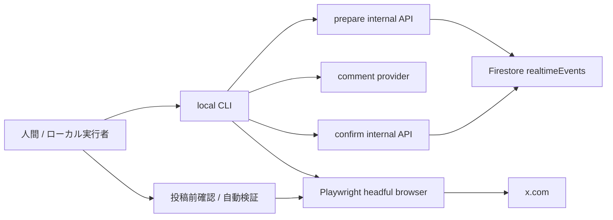

# X ブラウザ投稿自動化 要件・設計書

## 位置づけ

この文書は、X API を使わず、ローカル PC 上のログイン済みブラウザセッションを Playwright で操作して、謎チケ関連イベントを引用投稿する仕組みの要件と実装をまとめます。

**ステータス: 実装済みです。** 実装の正本は `src/` と `scripts/`、既存の X API 再投稿仕様は `docs/calendar-realtime/design.md` を参照します。

`#謎チケ売ります` の週末土日別件数を投稿するサマリ自動化は、個別イベントの引用投稿と分けて `docs/x-browser-posting/weekend-ticket-summary.md` に置きます。

関連する現行実装:

- `.github/workflows/x-repost-events.yml`
- `src/app/api/internal/x/repost/events/route.ts`
- `realtimeEvents` Firestore collection

## 重要な前提

- ログイン処理は自動化しない。
- X の認証情報、パスワード、2FA 情報、Cookie をコードや環境変数に保存しない。
- 投稿操作は、ユーザーが事前にログインした既存ブラウザプロファイル、または Playwright の storage state を使う。
- 投稿対象アカウント、storage state path、確認モードなどのローカル実行設定は `.env.x-browser-posting.local` などの Git 管理外 `.env` ファイルで定義する。
- X API は投稿・リポスト・引用リポストには使わない。
- 自動化対象は、候補選定、投稿画面への入力、投稿前確認、投稿実行、投稿結果のDB反映に限定する。
- CAPTCHA、追加認証、アカウント制限、ログイン画面が出た場合は即停止し、突破を試みない。

X 公式ヘルプは、X Web サイトをスクリプト操作する非 API 自動化にアカウント停止リスクがあること、重複・大量・攻撃的な投稿やリポストがポリシー違反になり得ることを示しています。この設計はリスクを消すものではないため、運用可否は人間が判断します。

参考:

- https://help.x.com/en/rules-and-policies/x-automation
- https://help.x.com/en/rules-and-policies/authenticity
- https://help.x.com/en/managing-your-account/locked-and-limited-accounts

## 目的

現在停止している `x-repost-events.yml` 相当の候補選定を、ローカルのブラウザ投稿支援に置き換えます。

やりたいこと:

1. `#謎チケ売ります` などの対象 hashtag から、既存の `realtimeEvents` 候補を 1 件選ぶ。
2. 事前定義した静的テンプレートから短いフォローコメントをランダムに選ぶ。
3. 元 Post URL を含めた引用投稿相当の投稿文を作る。
4. ログイン済み X ブラウザセッションで投稿画面に入力する。
5. 既定では投稿直前に人間が内容・アカウント・投稿先を確認する。
6. 投稿成功後に Firestore の対象イベントへ投稿済み状態を記録する。

## 非目的

- X へのログイン、パスワード入力、2FA、CAPTCHA 解決。
- 複数アカウント運用、アカウント切り替えの自動化。
- 返信、メンション、DM、フォロー、いいねの自動化。
- トレンド便乗、過剰 hashtag 付与、同一文面の大量投稿。
- クラウド上の完全無人運用。
- X の UI 変更や自動化検知を回避するための実装。

## 要件

### 機能要件

| ID   | 要件                                                                                                |
| ---- | --------------------------------------------------------------------------------------------------- |
| F-1  | ローカル Playwright 実行時に、既存ブラウザプロファイルまたは storage state を指定できる             |
| F-2  | X 認証情報をソースコード、`.env`、GitHub Secrets に保存しない                                       |
| F-3  | `x-repost-events.yml` と同じ文脈で、対象 hashtag の未処理イベントを候補にできる                     |
| F-4  | 候補は 1 実行 1 件を既定とする                                                                      |
| F-5  | 候補選定は Firestore 上で lease し、複数実行による二重投稿を防ぐ                                    |
| F-6  | フォローコメントは短く、元 Post の内容を過度に複製せず、事実を捏造しない                           |
| F-7  | フォローコメントは投稿前に確認・編集できる。`interactive` では人間確認を必須にする                 |
| F-8  | 投稿ボタン押下前に、最終投稿文、元 Post URL、投稿アカウントを確認または自動検証する                 |
| F-9  | 投稿成功後のみ DB を `posted` として更新する                                                        |
| F-10 | 失敗時は DB を `failed` または lease 解除に留め、投稿済みにしない                                   |
| F-11 | セレクタ変更時に修正箇所が集中する Page Object / selector registry にする                           |
| F-12 | dry-run では候補選定、コメント生成、投稿画面入力まで確認できるが、投稿実行と DB posted 更新をしない |
| F-13 | 投稿対象アカウントは Git 管理外 `.env` の `X_BROWSER_POST_ACCOUNT_HANDLE` で定義する                 |
| F-14 | `.env` で明示した場合に限り、投稿前の人間確認を省略した自動投稿を許可できる                         |

### 安全要件

| ID  | 要件                                                                                       |
| --- | ------------------------------------------------------------------------------------------ |
| S-1 | 既定値は `dryRun=true` とし、実投稿には明示フラグを要求する                                |
| S-2 | 既定の投稿上限は 1 回の実行で 1 件、最短 cooldown 120 分、1 日 6 件以下にする              |
| S-3 | 設定上の hard limit として、cooldown 30 分未満、1 日 8 件超を禁止する                      |
| S-4 | 直近投稿文との類似度を見て、ほぼ同じコメントの連続投稿を止める                             |
| S-5 | ログイン画面、ロック、制限、CAPTCHA、追加確認が検出されたら停止する                        |
| S-6 | 画面操作失敗時はスクリーンショットと selector profile version を保存し、再試行連打をしない |
| S-7 | `storageState` や browser profile は `local/` 配下など Git 管理外の場所に置く              |
| S-8 | storage state は認証済みセッション相当の秘密情報として扱い、共有・commit しない            |
| S-9 | 投稿前確認を省略する場合も、対象アカウント一致確認、rate limit、blocking state detection は省略しない |
| S-10 | `.env` の自動投稿設定だけでログイン、CAPTCHA、追加認証、アカウント切り替えを自動化しない |

## 全体アーキテクチャ案



### コンポーネント

| コンポーネント    | 配置案                                                        | 役割                                                           |
| ----------------- | ------------------------------------------------------------- | -------------------------------------------------------------- |
| local CLI         | `scripts/x-browser-post-events.mjs`                           | 候補取得、コメント生成、Playwright 起動、DB confirm をまとめる |
| prepare API       | `src/app/api/internal/x/browser-post/events/prepare/route.ts` | 候補選定、rate limit 判定、lease 作成                          |
| confirm API       | `src/app/api/internal/x/browser-post/events/confirm/route.ts` | 投稿結果を Firestore に反映                                    |
| candidate service | `src/server/x-browser-posting/candidate.ts`                   | 既存 repost 候補条件の共通化                                   |
| comment provider  | `src/server/x-browser-posting/comment.ts` / `comment-patterns.json` | 50 件の静的フォローコメントからランダム選択し、手入力上書きを扱う |
| config loader     | `scripts/x-browser-posting/config.mjs`                        | Git 管理外 `.env` を読み、アカウント・確認モード・上限値を検証  |
| selector registry | `scripts/x-browser-posting/selectors.mjs`                     | X UI セレクタを集中管理                                        |
| page object       | `scripts/x-browser-posting/xComposerPage.mjs`                 | X 投稿画面の操作を隠蔽                                         |
| local state       | `local/x-browser-posting/`                                    | storage state、エラー時スクリーンショット、実行ログ、ローカル lock |

既存の `src/app/api/internal/x/repost/events/route.ts` は X API による通常 Repost なので、ブラウザ投稿用 API とは分けます。候補選定ロジックだけは共通化し、X API 認証情報への依存をブラウザ投稿側へ持ち込まないようにします。

## 候補選定

現行 `x-repost-events.yml` の初期対象は `#謎チケ売ります` です。ブラウザ投稿版も最初は同じ hashtag を既定値にします。

候補条件:

- `capturedAt` が直近 24 時間以内。
- `lastReviewedAt == null`。
- `hashtags` に指定 hashtag の `#あり` または `#なし` 表記を含む。
- `isRealtimeEventVisible()` が true。
- `xBrowserPost.status` が未設定、または stale lease 以外でない。
- rate limit / cooldown に抵触しない。

候補は Firestore transaction で lease します。

| フィールド                   | 内容                               |
| ---------------------------- | ---------------------------------- |
| `xBrowserPost.status`        | `leased`                           |
| `xBrowserPost.reservationId` | CLI 実行ごとの UUID                |
| `xBrowserPost.reservedAt`    | lease 作成時刻                     |
| `xBrowserPost.reservedUntil` | 既定 10 分後                       |
| `xBrowserPost.reservedBy`    | ローカル識別子。個人情報を含めない |

lease 中に実行が落ちた場合は、`reservedUntil` 経過後に別実行で再候補化できます。

## 投稿方式

### 既定: 投稿本文に元 Post URL を含める

初期実装は、X の投稿画面に以下の形式を入力します。

```text
{フォローコメント}

{元Post URL}
```

X 側で元 Post URL が引用カードとして展開されれば、ユーザーには引用投稿相当に見えます。元 Post のリポスト/引用メニューを直接操作するより、必要な UI セレクタが少なく、保守しやすいです。

### オプション: 厳密な Quote Repost UI

厳密に X の Quote Repost UI を使う必要が出た場合のみ、元 Post 画面から Repost メニュー、Quote、投稿ダイアログを辿る mode を追加します。この mode は UI 変更に弱いため、既定にはしません。

## フォローコメント設計

コメントは「短い応援・案内」に限定します。例:

- `興味ある方はぜひ！`
- `予定ある人はぜひ！`
- `誰かに届け！`

通常運用では `src/server/x-browser-posting/comment-patterns.json` に定義した 50 パターンから、prepare のたびにランダムで 1 件を選びます。イベント内容からコメントを生成しないため、チケットの条件やイベント詳細を断定する文面は定義しません。

制約:

- 40 文字程度を目安にする。
- 元 Post 本文を長くコピーしない。
- 空席、価格、譲渡条件など、抽出精度に不安がある内容は断定しない。
- メンションや返信を自動生成しない。
- hashtag は増やさない。必要な場合も元 Post に含まれるものだけにする。
- 50 パターンの静的文面を用意し、同じ文面に偏りすぎないようランダム選択する。

Provider 方針:

| Provider              | 位置づけ                                                                 |
| --------------------- | ------------------------------------------------------------------------ |
| `template`            | 既定。50 件の静的フォローコメントからランダムで 1 件を選ぶ                |
| `--comment` / `X_BROWSER_POST_COMMENT` | 必要な場合に人間が書いたコメントで上書きする。空欄または空白だけなら静的テンプレートを使う |

通常は静的テンプレートのランダム選択を使い、個別に文面を指定したいときだけ CLI へ `--comment` で渡します。`--comment` / `X_BROWSER_POST_COMMENT` は前後空白を除去したあと、空でなければ上書きとして扱います。

## 投稿前確認

既定では、投稿前に headful browser と CLI の両方で確認します。

確認内容:

- X 上でログイン中のアカウントが想定どおりか。
- 投稿文が意図どおりか。
- 元 Post URL が含まれているか。
- 文字数上限を超えていないか。
- 追加認証、警告、制限表示が出ていないか。

実投稿には常に `--execute` を要求します。人間確認を省略する場合は、Git 管理外 `.env` で `X_BROWSER_POST_CONFIRMATION_MODE=auto` と `X_BROWSER_POST_AUTO_EXECUTE_ALLOWED=true` を両方指定したときだけ許可します。既存互換として、`X_BROWSER_POST_ALLOW_UNATTENDED=true` と `X_BROWSER_POST_REQUIRE_CONFIRMATION=false` の組み合わせも `unattended` として扱います。

確認モード:

| Mode | 条件 | 挙動 |
|---|---|---|
| `interactive` | 既定 | 投稿文、元 Post URL、ログイン中アカウントを表示し、投稿直前に人間の確認入力を待つ |
| `unattended` | `.env` で明示許可 | 人間入力を待たずに投稿する。ただし `--execute`、対象アカウント一致、rate limit、blocking state detection は必須 |

`unattended` はテスト用アカウントや手元検証での利用を想定します。本番アカウントで使う場合も、最初の数回は `interactive` で UI と DB 更新が安定していることを確認します。

## 外部設定

ローカルブラウザ投稿の設定は `.env.x-browser-posting.local` を既定ファイル名にします。このファイルは `.env*.local` として Git 管理外です。CLI は Playwright を使い、設定ファイルは単純な `KEY=value` のみを読む前提にします。

実行コマンド:

```bash
cp .env.x-browser-posting.example .env.x-browser-posting.local
npm run x:browser-post -- --login-only
npm run x:browser-post
npm run x:browser-post -- --execute
```

`--login-only` は初回ログイン用で、候補取得や内部 API 呼び出しをせず、`X_BROWSER_POST_CHROME_EXECUTABLE_PATH` の通常 Chrome を直接起動して `https://x.com/login` を開きます。ログイン状態を保存するため、`X_BROWSER_POST_USER_DATA_DIR` を使います。通常投稿時は `X_BROWSER_POST_CDP_URL` へ接続し、接続できない場合は `X_BROWSER_POST_AUTO_START_CHROME=true` により同じ専用 profile の通常 Chrome を自動起動してから接続します。`--execute` を付けない通常実行は dry-run です。X 投稿ボタンは押さず、DB の `posted` 更新もしません。

設定例:

```bash
X_BROWSER_POST_ACCOUNT_HANDLE=nazomatic
X_BROWSER_POST_STORAGE_STATE=
X_BROWSER_POST_USER_DATA_DIR=local/x-browser-posting/chrome-profile
X_BROWSER_POST_BROWSER_CHANNEL=chrome
X_BROWSER_POST_CHROME_EXECUTABLE_PATH=/Applications/Google Chrome.app/Contents/MacOS/Google Chrome
X_BROWSER_POST_CDP_URL=http://127.0.0.1:9222
X_BROWSER_POST_REMOTE_DEBUGGING_PORT=9222
X_BROWSER_POST_AUTO_START_CHROME=true
X_BROWSER_POST_CHROME_STARTUP_TIMEOUT_MS=20000
X_BROWSER_POST_CLEANUP_COMPOSE_TABS=true
X_BROWSER_POST_REQUIRE_CONFIRMATION=true
X_BROWSER_POST_ALLOW_UNATTENDED=false
X_BROWSER_POST_CONFIRMATION_MODE=interactive
X_BROWSER_POST_AUTO_EXECUTE_ALLOWED=false
X_BROWSER_POST_COMMENT=
X_BROWSER_POST_MAX_PER_RUN=1
X_BROWSER_POST_COOLDOWN_MINUTES=120
X_BROWSER_POST_DAILY_LIMIT=6
```

設定項目:

| 変数 | 必須 | 内容 |
|---|---|---|
| `X_BROWSER_POST_ACCOUNT_HANDLE` | 必須 | 投稿を許可する X handle。`@` はあってもなくてもよい |
| `X_BROWSER_POST_STORAGE_STATE` | 任意 | Playwright storage state path |
| `X_BROWSER_POST_USER_DATA_DIR` | 任意 | Playwright persistent context の user data dir |
| `X_BROWSER_POST_BROWSER_CHANNEL` | 任意 | Playwright が使う browser channel。通常 Chrome を使う場合は `chrome` |
| `X_BROWSER_POST_CHROME_EXECUTABLE_PATH` | 任意 | 通常 Chrome の実行ファイル path。`--login-only` ではこれを直接起動する |
| `X_BROWSER_POST_CDP_URL` | 任意 | 起動済み通常 Chrome へ接続する DevTools URL |
| `X_BROWSER_POST_REMOTE_DEBUGGING_PORT` | 任意 | `--login-only` で通常 Chrome を起動するときの remote debugging port |
| `X_BROWSER_POST_AUTO_START_CHROME` | 任意 | `true` なら CDP 接続できないときに通常 Chrome を自動起動する。既定 `true` |
| `X_BROWSER_POST_CHROME_STARTUP_TIMEOUT_MS` | 任意 | Chrome 自動起動後に CDP 接続を待つ最大時間。既定 `20000` |
| `X_BROWSER_POST_CLEANUP_COMPOSE_TABS` | 任意 | `true` なら実行開始時に古い X 投稿作成タブを閉じる。既定 `true` |
| `X_BROWSER_POST_REQUIRE_CONFIRMATION` | 任意 | `true` なら投稿前に人間確認を要求する。既定 `true` |
| `X_BROWSER_POST_ALLOW_UNATTENDED` | 任意 | 互換用。`true` なら確認省略 mode を許可する。既定 `false` |
| `X_BROWSER_POST_CONFIRMATION_MODE` | 任意 | `interactive` または `auto`。既定 `interactive` |
| `X_BROWSER_POST_AUTO_EXECUTE_ALLOWED` | 任意 | `CONFIRMATION_MODE=auto` を有効にする二重ロック。既定 `false` |
| `X_BROWSER_POST_COMMENT` | 任意 | 静的テンプレートのランダム選択を使わず、固定コメントで上書きする場合の文面 |
| `X_BROWSER_POST_MAX_PER_RUN` | 任意 | 1 実行あたりの上限。既定 1、hard limit 1 |
| `X_BROWSER_POST_COOLDOWN_MINUTES` | 任意 | cooldown 分数。既定 120、hard limit 30 分以上 |
| `X_BROWSER_POST_DAILY_LIMIT` | 任意 | 1 日上限。既定 6、hard limit 8 以下 |

`X_BROWSER_POST_ACCOUNT_HANDLE` は認証情報ではありませんが、誤爆防止の重要な設定です。Playwright が X を開いたあと、ページ上のログイン中 handle とこの値が一致しなければ停止します。アカウント切り替え UI を自動操作して一致させることはしません。

`X_BROWSER_POST_CONFIRMATION_MODE=auto` だけでは確認省略にしません。`X_BROWSER_POST_AUTO_EXECUTE_ALLOWED=true` も同時に必要です。どちらか片方だけの場合は安全側に倒して停止または `interactive` とします。既存互換の `X_BROWSER_POST_ALLOW_UNATTENDED=true` も、単独では確認省略になりません。

## DB 更新設計

投稿成功後、CLI は `confirm API` を呼び出して対象 document を更新します。

更新案:

| フィールド                            | 内容                                                 |
| ------------------------------------- | ---------------------------------------------------- |
| `lastReviewedAt`                      | 投稿済みまたは明示 skip の時刻。既存の重複防止と互換 |
| `xBrowserPost.status`                 | `posted`, `skipped`, `failed`                        |
| `xBrowserPost.quoteText`              | 実際に投稿したコメント                               |
| `xBrowserPost.quoteMode`              | `post_url` または `quote_ui`                         |
| `xBrowserPost.postedAt`               | 投稿成功確認時刻                                     |
| `xBrowserPost.postedPostURL`          | 取得できた場合の投稿後 URL                           |
| `xBrowserPost.postedPostId`           | 取得できた場合の投稿後 ID                            |
| `xBrowserPost.accountHandle`          | 投稿時に検証した X handle                            |
| `xBrowserPost.confirmationMode`       | `interactive` または `unattended`                    |
| `xBrowserPost.reservationId`          | prepare 時の lease ID                                |
| `xBrowserPost.selectorProfileVersion` | 使用した selector registry version                   |
| `xBrowserPost.error`                  | 失敗時の概要。秘密情報は入れない                     |

`postedPostURL` が取得できない場合でも、X UI 上で投稿成功 toast または遷移を確認できたときは `status=posted` にできます。ただし、その場合は `postedPostURL=null` とし、実行ログの source URL と DB の投稿結果で追跡します。スクリーンショットは失敗時の診断用に限定します。

## Rate Limit / Cooldown

X 側の非公開制限に依存しないよう、こちら側で保守的に止めます。

既定値:

| 項目         |      値 |
| ------------ | ------: |
| 1 実行あたり |  1 投稿 |
| cooldown     |  120 分 |
| 1 日上限     |  6 投稿 |
| 1 週間上限   | 30 投稿 |
| lease TTL    |   10 分 |

hard limit:

- cooldown は 30 分未満にできない。
- 1 日上限は 8 投稿を超えられない。
- `--force` を作る場合でも、rate limit 超過の実投稿は不可にする。

状態管理:

- Firestore に `X_BROWSER_POST_ACCOUNT_HANDLE` 単位の `lastPostedAt`, `dailyCount`, `weeklyCount` を持つ。
- ローカルにも `local/x-browser-posting/rate-state.json` を持ち、同一 PC の連続実行を早期に止める。
- Firestore 側を正とし、ローカル state は補助に留める。

## セレクタ保守方針

X の DOM と文言は変わりやすいため、セレクタは script 内に散らさず registry に集約します。

方針:

- Playwright の role / label ベース locator を優先する。
- X で安定している範囲では `data-testid` を fallback に使う。
- 日本語 UI と英語 UI のラベル候補を両方持つ。
- ひとつの action に複数 locator を定義し、成功した locator 名をログに残す。
- timeout は短くし、失敗時はスクリーンショットを保存して停止する。
- UI 変更時は selector registry と page object の修正だけで済ませる。

action 例:

| Action                | 例                                                      |
| --------------------- | ------------------------------------------------------- |
| `openComposer`        | intent URL または compose button                        |
| `findComposerTextbox` | role textbox、`tweetTextarea_0`                         |
| `fillComposer`        | keyboard input と paste fallback                        |
| `findSubmitButton`    | role button `Post` / `投稿`、`tweetButton`              |
| `detectBlockingState` | login form、captcha、account locked、rate limit warning |
| `confirmPosted`       | toast、URL 変化、投稿後 timeline 表示                   |

## ローカルセッション管理

storage state 方式:

1. ユーザーが手動で X にログインする。
2. Playwright の storage state を `local/x-browser-posting/storage-state.json` に保存する。
3. `.env.x-browser-posting.local` の `X_BROWSER_POST_STORAGE_STATE` に path を定義する。

browser profile 方式:

1. `.env.x-browser-posting.local` の `X_BROWSER_POST_USER_DATA_DIR` に専用 profile path を定義する。
2. 初回だけ `npm run x:browser-post -- --login-only` を実行し、通常 Chrome 上でユーザーが手動ログインする。
3. 以後は `npm run x:browser-post -- --execute` が同じ profile の通常 Chrome を自動起動し、CDP 接続して投稿操作を行う。

注意:

- `local/` は Git 管理外として扱う。
- `.env.x-browser-posting.local` も Git 管理外として扱う。
- storage state は Cookie / localStorage を含むため、パスワードと同じ強度で扱う。
- 共有端末や CI では使わない。
- 通常使いの Chrome profile ではなく、`local/x-browser-posting/chrome-profile` のような投稿専用 profile を使う。
- `X_BROWSER_POST_CLEANUP_COMPOSE_TABS=true` は専用 profile 内の古い投稿作成タブを閉じる前提のため、手作業の下書きと混在させない。

## 失敗時の扱い

| 状態                     | 処理                                                            |
| ------------------------ | --------------------------------------------------------------- |
| ログイン画面             | 停止。DB は posted にしない                                     |
| CAPTCHA / 追加認証       | 停止。突破しない                                                |
| アカウント制限表示       | 停止。運用者に確認を促す                                        |
| セレクタ不一致           | スクリーンショット保存、selector registry 修正対象にする        |
| 投稿文字数超過           | 投稿しない。コメント再生成または手編集                          |
| 投稿ボタン disabled      | 原因をログ化し、投稿しない                                      |
| 投稿成功不明             | `failed` または lease 解放。posted にはしない                   |
| 投稿成功後の DB 更新失敗 | ローカル pending confirm file を残し、再 confirm コマンドで復旧 |

## 実装状況

### Phase 1: DB と候補選定の分離

- 完了。X API repost route から候補選定ロジックを共通 service に切り出した。
- 完了。browser post 用 `prepare` / `confirm` API を追加した。
- 完了。Firestore schema に `xBrowserPost` を追加した。
- 完了。dry-run で候補と想定コメントを返す。

### Phase 2: ローカル CLI dry-run

- 完了。`.env.x-browser-posting.local` から対象アカウント、session path、確認モード、rate limit を読む。
- 完了。storage state / userDataDir を指定できる Playwright CLI を追加した。
- 完了。X compose 画面への入力までを dry-run で確認できる。
- 完了。セレクタ registry、エラー時スクリーンショット保存、blocking state detection を実装した。

### Phase 3: 人間確認つき実投稿

- 完了。`--execute` 時のみ投稿ボタンを押す。
- 完了。`interactive` と `unattended` の確認モードを実装し、どちらも対象アカウント一致を必須にする。
- 完了。投稿成功検出後に confirm API で `posted` 更新する。
- 完了。cooldown / daily limit を Firestore transaction で強制する。
- 完了。CDP 接続できない場合に通常 Chrome を自動起動し、接続待機してから候補予約へ進む。
- 完了。実行開始時に古い X 投稿作成タブを閉じ、入力対象のズレを抑える。

### Phase 4: コメント品質改善

- 完了。50 件の静的フォローコメントを定義し、ランダム選択する。
- 必要な場合だけ `--comment` / `X_BROWSER_POST_COMMENT` で手入力コメントを上書きする。
- 直近投稿との類似度チェックを強化する。

## 検証方針

- API service は unit test が未設定のため、まずは pure function 化して `npm run lint` と手動 API dry-run で確認する。
- Playwright は dry-run を既定にして、投稿ボタン押下直前で止まることを確認する。
- selector 失敗時のスクリーンショットが保存されることを確認する。
- DB は emulator または dry-run 用 event document で、lease、release、posted confirm の遷移を確認する。
- 本番投稿の初回は 1 件のみ、cooldown を 24 時間以上空けて手動監視する。

## 未決事項

- X の公式リスクを踏まえ、実運用するか、API credits 復旧まで待つか。
- 「投稿本文に元 Post URL」方式で十分か、厳密な Quote Repost UI が必要か。
- `postedPostURL` をどの程度確実に取得するか。
- rate limit の既定値をさらに厳しくするか。
- 本番運用で `unattended` を許可するか、テスト用アカウントだけに制限するか。
