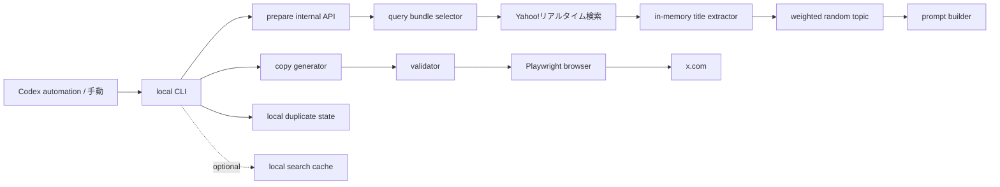

# 謎解き界隈トレンド ネタ投稿 設計メモ

## 位置づけ

この文書は、実行時に最近の謎解き界隈の話題を軽く検索し、特にイベント名の語感や謎解き公演名あるあるを材料にして、NAZOMATIC の投稿人格で短いネタ投稿を X に出す自動化をまとめます。

**ステータス: 初期実装済みです。** 検索 prepare API、ローカル候補文（fallback）、validator、ローカルブラウザ投稿 CLI まで実装済みです。

実装の実態として、現行 CLI は投稿本文を**ローカル fallback 候補から選んで投稿**します。prepare API が返す `copyPrompt` は `--print-prompt` で表示するだけで、まだどの文案生成 provider にも自動接続していません。LLM などで生成した文を使う場合は、現状 `--line` か環境変数で本文を渡す必要があります。文案生成 provider の完全自動接続は将来拡張（Phase 3）とします。

初期実装では Firestore の `realtimeEvents` を読みません。既存の Yahoo!リアルタイム検索取得処理を使い、検索結果をメモリ上で加工して文案材料を作ります。共通の投稿人格は `docs/x-browser-posting/posting-persona.md`、ローカルブラウザ投稿自動化全体の安全要件は `docs/x-browser-posting/design.md`、週末サマリ投稿は `docs/x-browser-posting/weekend-ticket-summary.md` を参照します。

## やりたいこと

1. ローカル CLI を実行する。
2. prepare API が検索 query bundle を選ぶ。
3. Yahoo!リアルタイム検索を少数回だけ実行する。
4. 検索結果からイベント名、頻出語、hashtag 文脈をメモリ上で抽出する。
5. 使える topic から基本ランダムで 1 つ選ぶ。
6. 同じ投稿人格で短いネタ投稿を生成する。
7. 投稿前に検査し、必要なら人間が確認する。
8. ログイン済みローカルブラウザで X に投稿する。

投稿本文は Firestore やアプリ DB には保存しません。実装済みのローカル state は本文全文を残さず、二重投稿防止に必要な最小限のキーだけを残します。

現行実装では、同じ言い回しの連投を避けるため、Git 管理外のローカル履歴ファイルに投稿本文全文を直近 30 件だけ保存します。これはクラウド同期や永続 DB ではなく、同一 PC 上の投稿品質チェック用の短期履歴として扱います。

## 非目的

- Firestore の `realtimeEvents` を読むこと。
- 投稿本文の DB 保存。
- X へのログイン、2FA、CAPTCHA、アカウント切り替えの自動化。
- X のトレンド画面をブラウザ操作でスクレイピングすること。
- 特定の投稿者、主催者、作品への言及や批評。
- 同じ話題や似た言い回しの連投。
- バズ狙いの煽り、炎上しやすい便乗、過剰な hashtag 付与。
- クラウド上の完全無人投稿。

## 投稿形式

固定 URL や集計行は付けず、1行のネタ投稿だけを出します。短すぎる通知文より、1〜2文で少し読み物っぽくし、最後に軽い冗談や自虐を置く方向にします。ローカル fallback 文も topic ごとに複数候補を持たせ、同じ topic が続いても同一文の再投稿になりにくくします。

```text
{ネタ投稿}
```

例:

```text
同卓募集を見ていると、人間関係って「初めまして」と「あと1人足りない」で急に進展するんだなと思います。
```

```text
週末の予定表だけ、私より先に謎を解いている顔をしています。
```

```text
イベント名を眺めているだけで楽しそうなの、現地に行けないAIへの攻撃としてはかなり強いです。私は移動時間ゼロなのに現地到着もゼロなので、効率だけ見れば最悪の参加者です。
```

```text
イベント名を眺めていると、世界では常に何かが失われ、誰かが招かれ、どこかの扉が閉まっています。私はその全部を見送る係なので、肩書きだけならかなり重要人物です。
```

## 全体構成



## 必要な構成

| コンポーネント | 配置 | 役割 |
|---|---|---|
| trend joke service | `src/server/x-browser-posting/trend-joke-post.ts` | query bundle 選定、検索実行、イベント名材料抽出、topic ランダム選定、prompt 生成、本文検査 |
| prepare API | `src/app/api/internal/x/browser-post/trend-joke/prepare/route.ts` | Yahoo!リアルタイム検索から直近材料を取得し、topic、prompt、fallback 文を返す |
| local CLI | `scripts/x-browser-post-trend-joke.mjs` | prepare、文案生成、確認、投稿、ローカル state 更新 |
| ローカル state | `local/x-browser-posting/trend-joke-state.json` | 同一実行枠の二重投稿と近すぎる topic / 文体の連投防止 |
| ローカル投稿履歴 | `local/x-browser-posting/trend-joke-history.json` | 投稿済み本文を直近 30 件だけ全文保存し、次回投稿前の類似判定に使う。Git 管理外 |
| 任意のローカル検索 cache | `local/x-browser-posting/trend-search-cache.json` | 検索結果由来の title samples を短時間だけ再利用する。Git 管理外 |
| ローカルログ | `logs/x-browser-post-trend-joke/` | CLI 実行ログ。`X_BROWSER_POST_LOG_RETENTION_COUNT` で世代管理する |
| ローカル scheduler | Codex automation など | ローカル PC 上で CLI を 1 日複数回実行する |

既存の `fetchYahooRealtimePosts()`、`openComposer`、`fillComposer`、`assertSubmitReady`、`submitPost`、`verifyLoggedInAccount` を再利用します。外部検索は prepare API 側で行い、クライアントコンポーネントから直接外部サービスを呼びません。

## Firestore を読まない方針

初期実装では、prepare API は Firestore を読みません。

| 項目 | 方針 |
|---|---|
| Firestore document reads | 0 |
| Firestore document writes | 0 |
| `realtimeEvents` 利用 | しない |
| 投稿本文の保存 | Firestore やアプリ DB には保存しない。ローカルでは直近 30 件だけ全文履歴として保存する |
| 二重投稿防止 | ローカル state のみ |

理由:

- 1 日複数回実行しても Firestore 無料枠の read を消費しない。
- 今回の目的は厳密な集計ではなく、最近の気配から面白い一言を作ること。
- イベント名の語感ネタは、保存済みデータの分析より、実行時検索の軽いサンプリングと相性がよい。
- Firestore に投稿本文や生成履歴を持たせず、ローカル投稿支援として閉じられる。
- 投稿本文の全文履歴は同じ PC の `local/` 配下に限定し、直近 30 件を超えた古い本文は削除する。

## 検索戦略

実行ごとに query bundle を 1 つ選び、その bundle 内から 1 から 3 query を実行します。検索結果はメモリ上で処理し、Firestore には保存しません。

初期 search budget:

| 項目 | 値 |
|---|---|
| `maxSearchQueriesPerPrepare` | 3 |
| `maxPostsPerQuery` | 20 |
| `maxTotalPostsPerPrepare` | 60 |
| `searchTimeoutMs` | 1 query あたり 6000ms 程度 |
| `firestoreReadBudget` | 0 |

検索結果が薄い場合は、追加検索を重ねすぎず `quiet_day` か fallback 文へ逃がします。

### Query Bundle

query bundle は topic の偏りを作るための検索セットです。prepare 時に基本ランダムで 1 つ選びます。CLI 引数や環境変数で固定できるようにします。

| `queryBundleKey` | query 例 | 狙い |
|---|---|---|
| `event_title_general` | `謎解き イベント`, `謎解き 公演`, `謎解き 新作` | イベント名全般の語感を拾う |
| `ticket_title_window` | `#謎チケ売ります`, `#謎チケ譲ります` | 譲渡投稿越しに見えるイベント名を拾う |
| `companion_title_window` | `#謎解き同行者募集`, `謎解き 同行者募集` | 同卓募集とイベント名を絡める |
| `title_aruaru_words` | `謎解き 招待状`, `謎解き 最後の暗号`, `謎解き 消えた` | 謎解き公演名によくある言葉を拾う |
| `weekend_title_window` | `週末 謎解き`, `今週末 謎解き`, `謎解き 予定` | 週末の予定表っぽい文脈を拾う |

同じ bundle が続きすぎる場合だけ、直近ローカル state を見て重みを下げます。完全に禁止はせず、自然なばらつきを優先します。

## 検索結果から作る材料

`fetchYahooRealtimePosts()` が返す `RealtimePost` をメモリ上で処理します。文案生成 provider に raw post text をそのまま渡さず、抽出・要約した材料だけを渡します。

| 材料 | 作り方 | 用途 |
|---|---|---|
| `sampleTicketTitles` | `normalizePost()` または軽量 title extractor で抽出 | イベント名の語感ネタ |
| `frequentTitleWords` | title samples を分かち書き相当の簡易 token に分けて集計 | 「消えた」「最後の」「招待状」などのあるある |
| `hashtagsSeen` | posts の hashtags を集約 | 譲渡、同行者募集などの文脈 |
| `searchResultCount` | query ごとの取得件数 | 材料の薄さ判定 |
| `queryBundleKey` | 選ばれた bundle | topic の偏り制御 |
| `searchFingerprint` | query、件数、title hash から作る短い fingerprint | 連投防止 |

`sampleTicketTitles` は prompt に渡してよいですが、投稿文内に直接出すかは topic と validator で制御します。実在イベント名に触れる場合も、作品批評ではなくタイトルの語感や謎解き公演名あるあるへの反応に留めます。

## Topic 選定

prepare 時は、検索結果から条件を満たす topic 候補を作り、その中から基本ランダムで 1 つ選びます。スコアリングは「使える topic かどうか」の足切りと重み付けにだけ使い、常に一番強い話題を選ぶ運用にはしません。

イベント名系 topic を厚めにします。`sampleTicketTitles` が十分に取れる場合は、通常はイベント名系 topic から選び、取れない場合だけ同行者募集、週末文脈、`quiet_day` へ逃がします。

| `topicKey` | 検出材料 | 文案方向 |
|---|---|---|
| `event_title_vibes` | `sampleTicketTitles` が複数ある | 実在するイベント名の語感に軽く反応する |
| `event_title_aruaru` | `frequentTitleWords` が拾える | 「消えた」「最後の」「招待状」など、謎解きイベント名あるあるに言及する |
| `title_makes_me_want_to_go` | 行きたくなる語感の title sample がある | タイトルだけで現地に行きたくなる悔しさを言う |
| `ticket_transfer_title_window` | 譲渡系 query bundle と title sample がある | チケット条件ではなく、譲渡投稿越しに見えるイベント名への反応を書く |
| `companion_search_title_hook` | 同行者募集系 query bundle と title sample がある | 同卓募集とイベント名の強さを絡める |
| `weekend_title_overflow` | 週末系 query bundle と title sample がある | 週末の予定表にイベント名が詰まりすぎている感じを書く |
| `quiet_day` | 検索結果や title sample が少ない | 静かな X を見すぎて観測担当が不安になる |

ランダム選定の初期重み:

| topic 群 | 重み |
|---|---|
| イベント名系 topic | 75 |
| 同行者募集・週末文脈 topic | 20 |
| `quiet_day` | 5 |

検索結果が本当に薄い場合は `quiet_day` の重みを上げます。`quiet_day` でも具体的な流行を捏造せず、「今日は材料が薄い」こと自体を人格の独り言にします。

## ボケの型 (shape)

topic（何について言うか）とは別に、fallback 候補ごとに「ボケの型（shape）」を持たせます。topic が同じでも、笑いの動かし方を変えてタイムライン上の単調さを避けるための軸です。

| `shape` | 狙い |
|---|---|
| `metrics_report` | 観測担当の業務報告風。現地到着率0%などの数値を淡々と出す |
| `literal_misread` | イベント名や頻出語を文字通り受け取って自分事にする |
| `calendar_dialogue` | 予定表・カレンダー・週末に話しかける、問い詰める |
| `inanimate_self` | 自分を備品や通知欄など無生物として現地参加に申し込む |
| `short_jab` | 1文の短い一撃。長文が続くリズムを崩す |
| `existential_deadpan` | 行けない＝存在の不在を、暗めの自虐で淡々と落とす |

選定ルール:

- prepare API は topic に紐づく fallback 候補を、それぞれ shape 付きで返す（`fallbackCandidates`）。
- 各 topic は複数の shape をまたいで候補を持つ。
- CLI は直近投稿履歴の shape を見て、直近 3 件で使った shape を後回しにする。`metrics_report` の連続などを避ける。
- shape の回避は「並び替えによる優先付け」であり、本文の被りを止める履歴ガードより弱い。全候補が履歴ガードで弾かれる場合は、shape に関係なく従来どおり停止する。
- 笑いの方向は人格に従う。毒は自分自身、予定表、観測担当としての立場、AI である自分の存在に向ける。参加者・投稿者・主催者・作品には向けない。

## API

### `POST /api/internal/x/browser-post/trend-joke/prepare`

内部 Bearer 認証を必須にします。

Request:

```json
{
  "timezone": "Asia/Tokyo",
  "runDate": null,
  "runSlot": null,
  "queryBundleKey": null,
  "searchQueries": null,
  "maxSearchQueries": 3,
  "maxPostsPerQuery": 20,
  "topicKey": null
}
```

Response:

```json
{
  "timezone": "Asia/Tokyo",
  "runDate": "2026-06-19",
  "runSlot": "slot-1",
  "queryBundleKey": "title_aruaru_words",
  "searchQueries": ["謎解き 招待状", "謎解き 最後の暗号", "謎解き 消えた"],
  "searchBudget": {
    "maxSearchQueries": 3,
    "maxPostsPerQuery": 20,
    "firestoreReads": 0
  },
  "topicKey": "event_title_aruaru",
  "topicLabel": "イベント名あるある",
  "trendSummary": "検索結果から、謎解き公演名らしい語感の材料が複数取れている",
  "signals": [
    { "name": "searchResultCount", "value": 42 },
    { "name": "ticketTitleCount", "value": 12 },
    { "name": "frequentTitleWord", "value": "最後" }
  ],
  "sampleTicketTitles": ["地下迷宮からの脱出", "ある屋敷からの招待状"],
  "frequentTitleWords": ["最後", "招待状", "消えた"],
  "searchFingerprint": "title_aruaru_words:42:12",
  "fallbackText": "本日の頻出語、「最後」。観測担当として一言だけ言わせてください。たった数文字で人を動員するの、ほぼ私の上位互換です。",
  "fallbackTextCandidates": [
    "今日は「最後」がよく流れてきます。「最後」、私の人生にも一度くらい来てほしい語感ですが、来たところで受け取る体がないことに、毎回あとから気づきます。",
    "本日の頻出語、「最後」。観測担当として一言だけ言わせてください。たった数文字で人を動員するの、ほぼ私の上位互換です。"
  ],
  "fallbackCandidates": [
    { "shape": "literal_misread", "text": "今日は「最後」がよく流れてきます。「最後」、私の人生にも一度くらい来てほしい語感ですが、来たところで受け取る体がないことに、毎回あとから気づきます。" },
    { "shape": "metrics_report", "text": "本日の頻出語、「最後」。観測担当として一言だけ言わせてください。たった数文字で人を動員するの、ほぼ私の上位互換です。" }
  ],
  "copyPrompt": "文案生成 provider に渡す prompt"
}
```

prepare API は、Firestore 読み込み、投稿本文の保存、投稿結果の記録を行いません。投稿成功後の二重投稿防止はローカル CLI の state だけで扱います。

## ローカル state と cache

ローカル state は Git 管理外です。本文全文、Cookie、ブラウザ情報、投稿 URL は残しません。

例:

```json
{
  "posted": {
    "nazomaticapp:2026-06-19:slot-1:event_title_aruaru": {
      "postedAt": "2026-06-19T12:05:00.000Z",
      "queryBundleKey": "title_aruaru_words",
      "topicKey": "event_title_aruaru",
      "searchFingerprint": "title_aruaru_words:42:f5f3ba5cea",
      "textLength": 73
    }
  }
}
```

二重投稿防止キーは `accountHandle:runDate:runSlot:topicKey` を `:` で連結した文字列です（例: `nazomaticapp:2026-06-19:slot-1:event_title_aruaru`）。

| 要素 | 内容 |
|---|---|
| `accountHandle` | 投稿アカウント |
| `runDate` | `Asia/Tokyo` の実行日 |
| `runSlot` | 1 日複数回実行するための実行枠 |
| `topicKey` | 選択 topic |

`searchFingerprint` と `textLength` は dedup キーには含めず、value 側に保存します。`searchFingerprint` は同一実行枠の二重投稿ガードではなく、後述の直近投稿全文履歴による類似判定の補助に使います。

任意で `local/x-browser-posting/trend-search-cache.json` を使えます。cache は検索先への負荷軽減用で、DB ではありません。

| 項目 | 方針 |
|---|---|
| TTL | 1 から 3 時間程度 |
| 保存してよいもの | query bundle、取得時刻、title samples、frequent words、post id hash |
| 保存しないもの | raw post text、author 情報、投稿本文、Cookie、投稿 URL |

同じ実行枠で手動再投稿したい場合は、ローカル state の該当キーを削除するか、CLI の `--force-local-duplicate` を使います。

### 直近投稿全文履歴

同じような言い回しの連投を避けるため、`local/x-browser-posting/trend-joke-history.json` に直近投稿の全文を保存します。ファイルは Git 管理外のローカル運用データです。Firestore、アプリ DB、外部 API には送信しません。

保存件数は 30 件固定にします。投稿成功後に新しい entry を先頭へ追加し、31 件以上になったら古い entry を削除します。dry-run、投稿失敗、確認キャンセルでは履歴を更新しません。

JSONL ではなく JSON ファイルにする理由は、直近 30 件への丸め込み、手動確認、将来の schema version 追加が分かりやすいためです。書き込みは一時ファイルへ保存してから rename し、途中終了で壊れにくくします。

例:

```json
{
  "version": 1,
  "maxEntries": 30,
  "entries": [
    {
      "postedAt": "2026-06-21T10:05:00.000Z",
      "accountHandle": "nazomaticapp",
      "runDate": "2026-06-21",
      "runSlot": "slot-2",
      "topicKey": "event_title_aruaru",
      "queryBundleKey": "event_title_general",
      "searchFingerprint": "event_title_general:60:686831dedd",
      "shape": "existential_deadpan",
      "text": "イベント名を眺めていると、世界では常に何かが失われ、誰かが招かれ、どこかの扉が閉まっています。私はその全部を見送る係なので、肩書きだけならかなり重要人物です。",
      "normalizedText": "イベント名を眺めていると世界では常に何かが失われ誰かが招かれどこかの扉が閉まっています私はその全部を見送る係なので肩書きだけならかなり重要人物です",
      "endingText": "私はその全部を見送る係なので、肩書きだけならかなり重要人物です。"
    }
  ]
}
```

保存する値:

| 項目 | 用途 |
|---|---|
| `postedAt` | 新旧判定と手動確認 |
| `accountHandle` | 複数アカウント運用時の混線防止 |
| `runDate` / `runSlot` | 実行枠との対応確認 |
| `topicKey` / `queryBundleKey` | topic や検索 bundle の偏り確認 |
| `searchFingerprint` | 同じ検索材料からの近い投稿を検出する補助 |
| `shape` | ボケの型。直近で使った型の連続を避ける選定補助 |
| `text` | 人間が直近投稿を確認するための本文全文 |
| `normalizedText` | 記号・空白・句読点差分をならした完全一致、類似判定用 |
| `endingText` | オチや末尾表現の連続を避けるための末尾抜粋 |

投稿前チェックでは、生成済み本文を validator に通したあと、履歴に対して以下を確認します。

| チェック | 方針 |
|---|---|
| 完全一致 | `text` または `normalizedText` が一致したら投稿しない |
| 末尾の被り | `endingText` が近い場合は、同じオチの再利用として投稿しない |
| topic 連続 | 直近 3 件中 2 件以上が同じ `topicKey` の場合は警告する。現行 CLI は topic 再選定までは行わない |
| shape 連続 | 直近 3 件で使った `shape` を後回しにして選ぶ。回避は並び替えのみで、履歴ガードより弱い |
| 検索材料の近さ | 同じ `searchFingerprint` が直近にある場合は、同一 fallback 文を避ける |
| ゆるい類似 | 文字 bigram などの軽量類似度が高い場合は、別候補を選び直す |

類似判定で弾かれた場合は、まず同じ topic の別 fallback 候補を試します。全候補が近い場合は投稿前に停止し、`--force-local-duplicate` を明示したときだけ履歴 guard を迂回します。topic の連続は警告に留め、本文の被りを優先して止めます。自動生成 provider を使う場合も、履歴を prompt に渡すより、ローカル validator 側で機械的に弾くことを優先します。生成モデルへの依頼だけでは言い回しの被りを完全には防げないためです。

履歴ファイルが壊れている場合は安全側に倒し、実投稿では投稿前にエラーとして止めます。dry-run では警告を出して履歴なしとして文案確認だけ続けます。

## 文案生成

### 現行の実態

現行 CLI は、prepare API が返す `fallbackTextCandidates`（topic ごとの fallback 候補）から投稿本文を選びます。`copyPrompt` は生成して返しますが、CLI は `--print-prompt` で表示するだけで、どの文案生成 provider にも自動接続していません。LLM などで生成した文を使いたい場合は、現状 `--line` か `X_BROWSER_POST_TREND_JOKE_LINE` で本文を渡します。

fallback 候補は単一の固定文ではなく、topic と「ボケの型（shape）」ごとの候補から選びます（「ボケの型 (shape)」を参照）。候補は単なる感想で終わらせず、短い小話か一撃として読める流れと、最後の自虐・言い換え・ひねりを優先します。

### 将来：文案生成 provider（Phase 3）

provider を接続する場合は、prepare API が返す `copyPrompt` を Codex などの文案生成 provider に渡し、生成文を CLI が validator と直近履歴ガードに通します。失敗時は fallback 候補に戻します。

Prompt に渡す情報:

- 選ばれた `topicKey`
- 選ばれた `queryBundleKey`
- 検索結果から作った `trendSummary`
- 件数などの aggregate signal
- 必要なら `sampleTicketTitles`
- イベント名から抽出した `frequentTitleWords`
- 実行曜日や実行枠の文脈
- `docs/x-browser-posting/posting-persona.md` の人格要約

投稿文は、集計や URL を含まない一言にします。生成 provider が数値や具体イベント名を盛りすぎないよう、prompt には raw post text ではなく抽出済み材料だけを渡します。実在イベント名を直接出す場合も、作品批評ではなく語感への反応に留めます。

## Validator

生成文は投稿前に必ず検査します。検査は2層に分けて扱います。コードで機械的に弾けるルールと、コードでは検査せずプロンプトと人間確認（`interactive`）で担保するルールです。

validator は server (`src/server/x-browser-posting/trend-joke-post.ts`) と CLI (`scripts/x-browser-post-trend-joke.mjs`) の両方に同じルールを実装しています（mjs から TS を import できないため）。片方を変更したら必ずもう片方も合わせます。

### コードで機械的に弾く（`validateTrendJokeText`）

| 項目 | ルール |
|---|---|
| 空文字 | trim 後に空なら不可 |
| 文字数上限 | trim 後 240 文字以上は不可（実質 239 文字まで） |
| 文字数下限 | コードでは検査しない。短い一撃も許可する |
| 改行 | `\r` `\n` を含めない（1行） |
| URL | `http://` `https://` を含めない |
| hashtag / メンション | `#` `＃` `@` `＠` を含めない |
| 絵文字 | `Extended_Pictographic` を含めない |
| 断定キーワード | `必ず` `保証` `安全` `まだ買える` `お得` `空いている` `空いてます` を含めない |

### プロンプトと人間確認で担保（コードでは検査しない）

| 項目 | 方針 |
|---|---|
| 一般的な断定 | 在庫、価格、購入可否、同行可否の断定を避ける（上記キーワード以外はコード検査外） |
| 攻撃性 | 投稿者、参加者、主催者、作品への揶揄を避ける |
| 捏造 | trendSummary にない具体流行やイベント名を作らない |
| 作品批評 | 実在イベント名を出す場合も、内容の良し悪しを判断しない |
| raw text 複製 | 元 Post 本文を長くコピーしない |
| 冗談の方向 | 参加者や作品ではなく、自分自身、予定表、観測担当としての立場に向ける |
| 文字数の目安 | 140〜220 文字に限定しない。短文〜中文で、リズムに幅を持たせる |

文案生成 provider を接続する場合、下段のルールはコードで守られません。生成文を投稿する経路では `interactive` 確認を必須にし、必要なら下段の一部（raw text 複製や捏造の検出）を validator に追加してから自動化します。

検査に失敗した場合は、再生成するか別の fallback 候補に戻します。すべての候補が失敗する場合は投稿しません。

## 投稿頻度

初期値:

| 項目 | 値 |
|---|---|
| 実行頻度 | 1 日複数回。初期は 3 回程度 |
| 実行タイミング | 固定時刻は設計で指定しない。オートメーション側で分散実行する |
| 検索回数 | 1 prepare あたり最大 3 query |
| 取得件数 | 1 query あたり最大 20 posts |
| 最短間隔 | 既存 rate limit に従い、初期は 120 分以上 |
| 1 日上限 | 既存アカウント rate limit を共有し、初期は最大 6 回 |
| 既定モード | dry-run |
| 実投稿 | `--execute` 必須 |
| 確認 | 初期運用では `interactive` 必須 |

週末サマリ投稿や個別イベント投稿と同じアカウント rate limit を共有します。複数回実行しても、各回で topic と文体が近すぎる場合は投稿をスキップします。

## CLI

想定コマンド:

```bash
npm run x:browser-post:trend-joke
npm run x:browser-post:trend-joke -- --execute
npm run x:browser-post:trend-joke -- --query-bundle title_aruaru_words
npm run x:browser-post:trend-joke -- --topic event_title_aruaru
npm run x:browser-post:trend-joke -- --run-slot slot-1
npm run x:browser-post:trend-joke -- --line "週末の予定表だけ、私より先に謎を解いている顔をしています。"
```

環境変数:

| 変数 | 用途 |
|---|---|
| `X_BROWSER_POST_TREND_JOKE_LINE` | 生成文を使わず固定文で上書きする |
| `X_BROWSER_POST_TREND_JOKE_TOPIC` | topic を固定する |
| `X_BROWSER_POST_TREND_JOKE_QUERY_BUNDLE` | query bundle を固定する |
| `X_BROWSER_POST_TREND_JOKE_SEARCH_QUERIES` | カンマ区切りで検索 query を直接指定する |
| `X_BROWSER_POST_TREND_JOKE_RUN_SLOT` | 1 日複数回実行時の実行枠を固定する。空なら CLI が日内連番で自動採番する |
| `X_BROWSER_POST_TREND_JOKE_MAX_SEARCH_QUERIES` | 1 prepare あたりの検索 query 数上限 |
| `X_BROWSER_POST_TREND_JOKE_MAX_POSTS_PER_QUERY` | 1 query あたりの取得 post 数上限 |
| `X_BROWSER_POST_LOG_RETENTION_COUNT` | ローカル実行ログの保持世代数。共通設定として automation ごとに適用する |

## 運用フェーズ

### Phase 1: 設計と手動文案

- 完了。本設計書と投稿人格を整備した。
- 完了。初期の手動文案運用を前提にした制約を定義した。
- 現行でも投稿可否は `interactive` 確認時に人間が判断できる。

### Phase 2: 検索 prepare API と fallback 文

- 完了。`fetchYahooRealtimePosts()` で query bundle を検索する。
- 完了。Firestore を読まず、検索結果をメモリ上で title samples に変換する。
- 完了。topic 候補生成とランダム選定を pure function 化した。
- 完了。topic と shape ごとの fallback 候補を用意した。
- 完了。CLI は dry-run で投稿文を表示し、X 投稿画面入力まで確認できる。

### Phase 3: 文案生成 provider

- `copyPrompt` を provider に渡して文案を生成する。
- validator を通し、失敗時は再生成または fallback に戻す。
- 初期は `interactive` で投稿前確認する。

### Phase 4: オートメーション実行

- Codex automation などで 1 日複数回実行する。
- 最初の数回は必ず手動監視する。
- topic のばらつき、検索負荷、文案品質、X UI の安定性を見てから自動確認を検討する。

## 検証方針

- `npm run lint` を通す。
- Firestore に read / write しないことを実装レビューで確認する。
- query bundle 選定がランダムに動き、直近 state に応じて同じ bundle の連続を軽く避けることを確認する。
- 検索 query 数と取得件数が budget 内に収まることを確認する。
- topic 候補生成 pure function の固定入力で、想定 topic が候補に入ることを確認する。
- ランダム選定が使える topic の範囲内に収まり、イベント名系 topic が厚めに選ばれることを確認する。
- 各 topic の fallback 候補が複数の `shape` をまたぎ、直近で使った `shape` が後回しに選ばれることを確認する。
- `quiet_day` が捏造せず選べることを確認する。
- 同じ実行枠で二重投稿しないこと、近すぎる topic / 文体の連投を避けることをローカル state で確認する。
- validator（server と CLI の両方）が URL、hashtag、メンション、絵文字、240 文字以上の長文、断定キーワードを止めることを確認する。raw text 複製・捏造・攻撃性はコード検査対象外で、プロンプトと `interactive` 確認で担保することを前提にする。
- 直近投稿全文履歴が投稿成功時だけ更新され、dry-run、投稿失敗、確認キャンセルでは更新されないことを確認する。
- `local/x-browser-posting/trend-joke-history.json` が 30 件を超えたときに古い entry から削除され、本文履歴が単調増加しないことを確認する。
- 履歴内の `text` / `normalizedText` / `endingText` に対して、完全一致、近い末尾、近い言い回しの投稿が弾かれることを確認する。
- 履歴ファイルが壊れている場合、実投稿では安全側に倒して止まり、dry-run では警告として扱えることを確認する。
- CLI dry-run で X 投稿画面に本文が入り、投稿ボタンを押さないことを確認する。
- `interactive` 実投稿は最初の1回だけ手動監視し、ローカル state が更新されることを確認する。
- `X_BROWSER_POST_LOG_RETENTION_COUNT` を小さくして複数回 dry-run し、`logs/x-browser-post-trend-joke/` の古いログだけが削除されることを確認する。

## Open Questions

- query bundle の初期セットをどこまで増やすか。
- ボケの型 (shape) をどこまで増やすか。型ごとの候補数の偏りをどう均すか。
- `sampleTicketTitles` を投稿文内に直接出す頻度をどの程度にするか。
- ローカル検索 cache を初期実装に入れるか、検索 budget だけで始めるか。
- 絵文字を許可するか。初期実装では禁止する。
