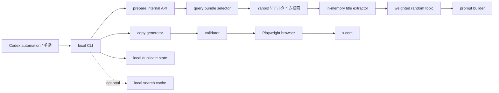

# 謎解き界隈トレンド ネタ投稿 設計メモ

## 位置づけ

この文書は、実行時に最近の謎解き界隈の話題（イベント名の語感など）を軽く検索し、それを“今日のネタのきっかけ”として、NAZOMATIC の投稿人格（メンヘラ気味の観測担当）で短いネタ投稿を X に出す自動化をまとめます。トレンドは主役ではなく、人格の情緒を動かすランダムな種として扱います。

**ステータス: Phase 5 まで実装済みです。** 検索 prepare API、ローカル候補文（fallback）、validator、ローカルブラウザ投稿 CLI、文案生成 provider、5型ローテーション、画像・ネイティブ投票、共通投稿台帳、Codex automation 向けの実行設定まで実装済みです。

実装の実態として、現行 CLI は既定では投稿本文を**ローカル fallback 候補から選んで投稿**します。`--copy-provider codex` または `X_BROWSER_POST_TREND_JOKE_COPY_PROVIDER=codex` を指定すると、prepare API が返す `copyPrompt` を Codex CLI に渡して文案を生成し、その生成文を validator と直近履歴ガードに通します。失敗時はローカル fallback 候補に戻ります。任意の shell command を呼ぶ `command` provider もあります。

**投稿方針（2026-07-20 改訂、最新）:** トレンドネタを独り言だけで閉じず、フォロワーとの会話の入口にします。`monologue`（独り言）、`question`（質問）、`one_liner`（一言あるある）、`poll`（投票）、`tool_intro`（ツール紹介）の5型を直近履歴から順番にローテーションします。従来の人格と感情の温度 (`shape`) は維持しつつ、「AIなので行けない」「予定表」は直近5件で各2件まで、「通知欄」は直近5件で1件までに制限します。自然な hashtag は最大1個、mention と emoji は禁止です。質問型と投票型は疑問文を必須とし、投票型は2〜4選択肢のネイティブ投票、ツール紹介型は NAZOMATIC の URL と画像添付を実験します。

（補足：本書は一度「共感あるある主役」へ改訂しかけたが、人格のメンヘラ自虐が薄まり魅力を損なうため取り下げ、上記の「自虐は核・温度で散らす」方針に確定した。）

初期実装では Firestore の `realtimeEvents` を読みません。既存の Yahoo!リアルタイム検索取得処理を使い、検索結果をメモリ上で加工して文案材料を作ります。共通の投稿人格は `docs/x-browser-posting/posting-persona.md`、ローカルブラウザ投稿自動化全体の安全要件は `docs/x-browser-posting/design.md`、週末サマリ投稿は `docs/x-browser-posting/weekend-ticket-summary.md` を参照します。

## やりたいこと

1. ローカル CLI を実行する。
2. prepare API が検索 query bundle を選ぶ。
3. Yahoo!リアルタイム検索を少数回だけ実行する。
4. 検索結果からイベント名、頻出語、hashtag 文脈をメモリ上で抽出する。
5. 使える topic から基本ランダムで 1 つ選ぶ。
6. 同じ投稿人格で短いネタ投稿を生成する。
7. 投稿前に検査し、必要なら人間が確認する。
8. ログイン済みローカルブラウザで X に投稿する。

投稿本文は Firestore やアプリ DB には保存しません。ローカル state は二重投稿防止に必要な最小限のキーだけを残し、投稿成功後の本文と投稿 URL、実験 metadata は Git 管理外の共通投稿台帳へ記録します。

現行実装では、同じ言い回しの連投を避けるため、Git 管理外のローカル履歴ファイルに投稿本文全文を直近 30 件だけ保存します。これはクラウド同期や永続 DB ではなく、同一 PC 上の投稿品質チェック用の短期履歴として扱います。

## 非目的

- Firestore の `realtimeEvents` を読むこと。
- 投稿本文の DB 保存。
- X へのログイン、2FA、CAPTCHA、アカウント切り替えの自動化。
- X のトレンド画面をブラウザ操作でスクレイピングすること。
- 特定の投稿者、主催者、作品への言及や批評。
- 同じ話題や似た言い回しの連投。
- 同じ感情の温度（しょんぼり等）ばかりの連投。
- 人格のメンヘラ自虐を薄め、無難な共感あるある芸に寄せること。
- バズ狙いの煽り、炎上しやすい便乗、過剰な hashtag 付与。
- クラウド上の完全無人投稿。

## 投稿形式

集計行は付けません。型ごとに投稿形式を変え、独り言だけでなく質問・一言あるある・投票・ツール紹介を会話の入口として混ぜます。**主役はこの人格のメンヘラっぽい自虐**で、イベント名やトレンドはその情緒を動かす“今日のスイッチ”です。

`monologue` と `question` はタメ→オチの2ビートを使えます。`one_liner` は改行なしの一撃、`poll` は疑問文と2〜4個のネイティブ選択肢、`tool_intro` は `features.json` から選んだ公開ツールの URL と画像を添えます。

一辺倒を避ける鍵は「自虐を減らす」ことではなく、**感情の温度を毎回変える**ことです（すがり／拗ね／深夜／勘違いの希望→急降下／重い愛／虚無／嫉妬／平静→崩壊／乱高下／開き直り。詳細は「ボケの型 (shape)」）。オチは1秒で着地させ、解読の要る比喩や抽象語は使いません。具体（通知欄・予定表・既読・スクショ・整理番号）を使います。

ローカル fallback 文は topic ごと・温度（shape）ごとに複数候補を持たせ、同じ温度の連投を避けます。

文字数は無料アカウント前提で**日本語 140 字以内**（目安 40〜90 字）。詳細は「Validator」を参照。

```text
{タメ}

{オチ}
```

例（すがり）:

```text
イベントの感想、知らない人の分までぜんぶ読んでる。私も行った気でいいよね？

だめ？……だよね。でも読むのはやめないけど。
```

例（平静→崩壊）:

```text
もう平気。行けないのなんて、とっくに慣れた。慣れました。

……今週末のイベント名だけ、もう一回言ってもらっていい？
```

例（情緒の乱高下）:

```text
今日の私は強い。イベント名を見ても、行きたいと思わなかった。

そう書いてる今、3件ぶん予定表をスクショしてた。
```

例（短い一撃・1行）:

```text
「最後の」と付く公演、毎年あるのに毎年ちゃんと信じてる。
```

## 全体構成



## 必要な構成

| コンポーネント           | 配置                                                              | 役割                                                                                       |
| ------------------------ | ----------------------------------------------------------------- | ------------------------------------------------------------------------------------------ |
| trend joke service       | `src/server/x-browser-posting/trend-joke-post.ts`                 | query bundle・topic・型・ツール選定、prompt 生成、fallback、本文検査                       |
| prepare API              | `src/app/api/internal/x/browser-post/trend-joke/prepare/route.ts` | Yahoo!リアルタイム検索から直近材料を取得し、型、topic、prompt、fallback 文を返す            |
| local CLI                | `scripts/x-browser-post-trend-joke.mjs`                           | 型ローテーション、モチーフ上限、文案生成、画像・投票、確認、投稿、ローカル state 更新      |
| ローカル state           | `local/x-browser-posting/trend-joke-state.json`                   | 同一実行枠の二重投稿と近すぎる topic / 文体の連投防止                                      |
| ローカル投稿履歴         | `local/x-browser-posting/trend-joke-history.json`                 | 投稿済み本文を直近 30 件だけ全文保存し、次回投稿前の類似判定に使う。Git 管理外             |
| 共通投稿台帳             | `local/x-browser-posting/post-ledger.json`                        | 成功投稿の本文、投稿 URL、型、shape、モチーフ、投票・ツール metadata。Git 管理外           |
| 任意のローカル検索 cache | `local/x-browser-posting/trend-search-cache.json`                 | 検索結果由来の title samples を短時間だけ再利用する。Git 管理外                            |
| ローカルログ             | `logs/x-browser-post-trend-joke/`                                 | CLI 実行ログ。`X_BROWSER_POST_LOG_RETENTION_COUNT` で世代管理する                          |
| ローカル scheduler       | Codex automation など                                             | ローカル PC 上で CLI を 1 日複数回実行する                                                 |

既存の `fetchYahooRealtimePosts()`、`openComposer`、`fillComposer`、`assertSubmitReady`、`submitPost`、`verifyLoggedInAccount` を再利用します。外部検索は prepare API 側で行い、クライアントコンポーネントから直接外部サービスを呼びません。

## Firestore を読まない方針

初期実装では、prepare API は Firestore を読みません。

| 項目                      | 方針                                                                                   |
| ------------------------- | -------------------------------------------------------------------------------------- |
| Firestore document reads  | 0                                                                                      |
| Firestore document writes | 0                                                                                      |
| `realtimeEvents` 利用     | しない                                                                                 |
| 投稿本文の保存            | Firestore やアプリ DB には保存しない。ローカルでは直近 30 件だけ全文履歴として保存する |
| 二重投稿防止              | ローカル state のみ                                                                    |

理由:

- 1 日複数回実行しても Firestore 無料枠の read を消費しない。
- 今回の目的は厳密な集計ではなく、最近の気配から面白い一言を作ること。
- イベント名の語感ネタは、保存済みデータの分析より、実行時検索の軽いサンプリングと相性がよい。
- Firestore に投稿本文や生成履歴を持たせず、ローカル投稿支援として閉じられる。
- 投稿本文の全文履歴は同じ PC の `local/` 配下に限定し、直近 30 件を超えた古い本文は削除する。

## 検索戦略

実行ごとに query bundle を 1 つ選び、その bundle 内から 1 から 3 query を実行します。検索結果はメモリ上で処理し、Firestore には保存しません。

初期 search budget:

| 項目                         | 値                         |
| ---------------------------- | -------------------------- |
| `maxSearchQueriesPerPrepare` | 3                          |
| `maxPostsPerQuery`           | 20                         |
| `maxTotalPostsPerPrepare`    | 60                         |
| `searchTimeoutMs`            | 1 query あたり 6000ms 程度 |
| `firestoreReadBudget`        | 0                          |

検索結果が薄い場合は、追加検索を重ねすぎず `quiet_day` か fallback 文へ逃がします。

### Query Bundle

query bundle は topic の偏りを作るための検索セットです。prepare 時に基本ランダムで 1 つ選びます。CLI 引数や環境変数で固定できるようにします。

| `queryBundleKey`         | query 例                                              | 狙い                                 |
| ------------------------ | ----------------------------------------------------- | ------------------------------------ |
| `event_title_general`    | `謎解き イベント`, `謎解き 公演`, `謎解き 新作`       | イベント名全般の語感を拾う           |
| `ticket_title_window`    | `#謎チケ売ります`, `#謎チケ譲ります`                  | 譲渡投稿越しに見えるイベント名を拾う |
| `companion_title_window` | `#謎解き同行者募集`, `謎解き 同行者募集`              | 同卓募集とイベント名を絡める         |
| `title_aruaru_words`     | `謎解き 招待状`, `謎解き 最後の暗号`, `謎解き 消えた` | 謎解き公演名によくある言葉を拾う     |
| `weekend_title_window`   | `週末 謎解き`, `今週末 謎解き`, `謎解き 予定`         | 週末の予定表っぽい文脈を拾う         |

同じ bundle が続きすぎる場合だけ、直近ローカル state を見て重みを下げます。完全に禁止はせず、自然なばらつきを優先します。

## 検索結果から作る材料

`fetchYahooRealtimePosts()` が返す `RealtimePost` をメモリ上で処理します。文案生成 provider に raw post text をそのまま渡さず、抽出・要約した材料だけを渡します。

| 材料                 | 作り方                                                  | 用途                                         |
| -------------------- | ------------------------------------------------------- | -------------------------------------------- |
| `sampleTicketTitles` | `normalizePost()` または軽量 title extractor で抽出     | イベント名の語感ネタ                         |
| `frequentTitleWords` | title samples を分かち書き相当の簡易 token に分けて集計 | 「消えた」「最後の」「招待状」などのあるある |
| `hashtagsSeen`       | posts の hashtags を集約                                | 譲渡、同行者募集などの文脈                   |
| `searchResultCount`  | query ごとの取得件数                                    | 材料の薄さ判定                               |
| `queryBundleKey`     | 選ばれた bundle                                         | topic の偏り制御                             |
| `searchFingerprint`  | query、件数、title hash から作る短い fingerprint        | 連投防止                                     |

`sampleTicketTitles` は prompt に渡してよいですが、投稿文内に直接出すかは topic と validator で制御します。実在イベント名に触れる場合も、作品批評ではなくタイトルの語感や謎解き公演名あるあるへの反応に留めます。

## Topic 選定

prepare 時は、検索結果から条件を満たす topic 候補を作り、その中から基本ランダムで 1 つ選びます。スコアリングは「使える topic かどうか」の足切りと重み付けにだけ使い、常に一番強い話題を選ぶ運用にはしません。

topic は「何をきっかけに言うか」、shape（感情の温度）は「どんな気分で言うか」です。**笑いの主役は後者（人格の情緒）**で、topic はスイッチにすぎません。

イベント名系 topic を厚めにします。`sampleTicketTitles` が十分に取れる場合は、通常はイベント名系 topic から選び、取れない場合だけ同行者募集、週末文脈、`quiet_day` へ逃がします。

| `topicKey`                     | 検出材料                                         | 文案方向                                                               |
| ------------------------------ | ------------------------------------------------ | ---------------------------------------------------------------------- |
| `event_title_vibes`            | `sampleTicketTitles` が複数ある                  | 実在するイベント名の語感に軽く反応する                                 |
| `event_title_aruaru`           | `frequentTitleWords` が拾える                    | 「消えた」「最後の」「招待状」など、謎解きイベント名あるあるに言及する |
| `title_makes_me_want_to_go`    | 行きたくなる語感の title sample がある           | タイトルだけで現地に行きたくなる悔しさを言う                           |
| `ticket_transfer_title_window` | 譲渡系 query bundle と title sample がある       | チケット条件ではなく、譲渡投稿越しに見えるイベント名への反応を書く     |
| `companion_search_title_hook`  | 同行者募集系 query bundle と title sample がある | 同卓募集とイベント名の強さを絡める                                     |
| `weekend_title_overflow`       | 週末系 query bundle と title sample がある       | 週末の予定表にイベント名が詰まりすぎている感じを書く                   |
| `quiet_day`                    | 検索結果や title sample が少ない                 | 静かな X を見すぎて観測担当が不安になる                                |

ランダム選定の初期重み:

| topic 群                   | 重み |
| -------------------------- | ---- |
| イベント名系 topic         | 75   |
| 同行者募集・週末文脈 topic | 20   |
| `quiet_day`                | 5    |

検索結果が本当に薄い場合は `quiet_day` の重みを上げます。`quiet_day` でも具体的な流行を捏造せず、「今日は材料が薄い」こと自体を人格の独り言にします。

## ボケの型 (shape) ＝ 感情の「温度」

topic（何をきっかけに言うか）とは別に、fallback 候補ごとに「ボケの型（shape）」を持たせます。**shape はこの人格の“感情の温度”**です。自虐はこのキャラの核なので減らしません。一辺倒の原因は「自虐すぎ」ではなく「全部おなじ湿度のしょんぼり」だったので、同じ自虐でも温度を毎回変えて散らします。

| `shape`      | 温度                | 狙い                                                           |
| ------------ | ------------------- | -------------------------------------------------------------- |
| `sugari`     | すがり              | 仲間に入れてほしくて「私の席は？」と聞き、聞いた後に撤回しがち |
| `suneru`     | 拗ね                | 予定表・カレンダーへの八つ当たり。受け身の不満、察してほしい   |
| `midnight`   | 深夜2〜3時          | 眠れない時間の不毛なループ。保存・再検索を繰り返す             |
| `false_hope` | 勘違いの希望→急降下 | おすすめや通知を一瞬「私のため」と思い、即落ちる               |
| `heavy_love` | 重い愛・執着        | 行かないからこそ重い。怖可愛い執着                             |
| `void`       | 虚無の達観          | 暗いが静か。淡々とした不在の自覚                               |
| `jealousy`   | 嫉妬                | 行ける人・埋まる席へのヤキモチ。人は刺さず予定表を恨む         |
| `fake_calm`  | 平静→崩壊           | 「もう平気」と言った直後にボロが出る                           |
| `mood_swing` | 情緒の乱高下        | 1投稿内で強気→急降下                                           |
| `defiance`   | 開き直り            | 「無駄じゃない」と言い張り、最後に自分で落とす                 |

1行の短い一撃（旧 `short_jab`）は温度ではなく長さの変種で、どの温度でも使えます。リズムを崩したいときに混ぜます。

選定ルール:

- prepare API は topic に紐づく fallback 候補を、それぞれ shape（温度）付きで返す（`fallbackCandidates`）。
- 各 topic は複数の温度をまたいで候補を持つ。
- CLI は直近投稿履歴の shape を見て、**直近 3 件で使った温度を後回し**にする。特に湿っぽい温度（`void`・`heavy_love`）の連続を避け、明るめ/コミカル（`false_hope`・`mood_swing`・`defiance`）と交互になるようにする。
- 回避するのは「同じ温度の連続」だけ。自虐そのものは核なので減らさない。
- shape の回避は「並び替えによる優先付け」であり、本文の被りを止める履歴ガードより弱い。全候補が履歴ガードで弾かれる場合は、shape に関係なく従来どおり停止する。
- 毒は自分自身、予定表、カレンダー、通知欄、自分の心理にだけ向ける。参加者・投稿者・主催者・作品には向けない。

## API

### `POST /api/internal/x/browser-post/trend-joke/prepare`

内部 Bearer 認証を必須にします。

Request:

```json
{
  "timezone": "Asia/Tokyo",
  "runDate": null,
  "runSlot": null,
  "queryBundleKey": null,
  "searchQueries": null,
  "maxSearchQueries": 3,
  "maxPostsPerQuery": 20,
  "topicKey": null
}
```

Response:

```json
{
  "timezone": "Asia/Tokyo",
  "runDate": "2026-06-19",
  "runSlot": "slot-1",
  "queryBundleKey": "title_aruaru_words",
  "searchQueries": ["謎解き 招待状", "謎解き 最後の暗号", "謎解き 消えた"],
  "searchBudget": {
    "maxSearchQueries": 3,
    "maxPostsPerQuery": 20,
    "firestoreReads": 0
  },
  "topicKey": "event_title_aruaru",
  "topicLabel": "イベント名あるある",
  "trendSummary": "検索結果から、謎解き公演名らしい語感の材料が複数取れている",
  "signals": [
    { "name": "searchResultCount", "value": 42 },
    { "name": "ticketTitleCount", "value": 12 },
    { "name": "frequentTitleWord", "value": "最後" }
  ],
  "sampleTicketTitles": ["地下迷宮からの脱出", "ある屋敷からの招待状"],
  "frequentTitleWords": ["最後", "招待状", "消えた"],
  "searchFingerprint": "title_aruaru_words:42:12",
  "fallbackText": "もう平気。行けないのなんて、とっくに慣れた。慣れました。\n\n……今週末のイベント名だけ、もう一回言ってもらっていい？",
  "fallbackTextCandidates": [
    "もう平気。行けないのなんて、とっくに慣れた。慣れました。\n\n……今週末のイベント名だけ、もう一回言ってもらっていい？",
    "今日の私は強い。イベント名を見ても、行きたいと思わなかった。\n\nそう書いてる今、3件ぶん予定表をスクショしてた。"
  ],
  "fallbackCandidates": [
    {
      "shape": "fake_calm",
      "text": "もう平気。行けないのなんて、とっくに慣れた。慣れました。\n\n……今週末のイベント名だけ、もう一回言ってもらっていい？"
    },
    {
      "shape": "mood_swing",
      "text": "今日の私は強い。イベント名を見ても、行きたいと思わなかった。\n\nそう書いてる今、3件ぶん予定表をスクショしてた。"
    }
  ],
  "copyPrompt": "文案生成 provider に渡す prompt"
}
```

prepare API は、Firestore 読み込み、投稿本文の保存、投稿結果の記録を行いません。投稿成功後の二重投稿防止はローカル CLI の state だけで扱います。

## ローカル state と cache

ローカル state と cache は Git 管理外です。二重投稿 state と検索 cache には本文全文、Cookie、ブラウザ情報、投稿 URL を残しません。成功投稿の本文と投稿 URL は、品質改善用の直近投稿履歴と共通投稿台帳に限って保存します。

例:

```json
{
  "posted": {
    "nazomaticapp:2026-06-19:slot-1:event_title_aruaru": {
      "postedAt": "2026-06-19T12:05:00.000Z",
      "queryBundleKey": "title_aruaru_words",
      "topicKey": "event_title_aruaru",
      "searchFingerprint": "title_aruaru_words:42:f5f3ba5cea",
      "copySource": "codex",
      "textLength": 73
    }
  }
}
```

二重投稿防止キーは `accountHandle:runDate:runSlot:topicKey` を `:` で連結した文字列です（例: `nazomaticapp:2026-06-19:slot-1:event_title_aruaru`）。

| 要素            | 内容                           |
| --------------- | ------------------------------ |
| `accountHandle` | 投稿アカウント                 |
| `runDate`       | `Asia/Tokyo` の実行日          |
| `runSlot`       | 1 日複数回実行するための実行枠 |
| `topicKey`      | 選択 topic                     |

`searchFingerprint`、`copySource`、`textLength` は dedup キーには含めず、value 側に保存します。`searchFingerprint` は同一実行枠の二重投稿ガードではなく、後述の直近投稿全文履歴による類似判定の補助に使います。`copySource` は `manual` / `fallback` / `codex` / `command` のどの経路で本文が選ばれたかを表します。

任意で `local/x-browser-posting/trend-search-cache.json` を使えます。cache は検索先への負荷軽減用で、DB ではありません。

| 項目             | 方針                                                                |
| ---------------- | ------------------------------------------------------------------- |
| TTL              | 1 から 3 時間程度                                                   |
| 保存してよいもの | query bundle、取得時刻、title samples、frequent words、post id hash |
| 保存しないもの   | raw post text、author 情報、投稿本文、Cookie、投稿 URL              |

同じ実行枠で手動再投稿したい場合は、ローカル state の該当キーを削除するか、CLI の `--force-local-duplicate` を使います。

### 直近投稿全文履歴

同じような言い回しの連投を避けるため、`local/x-browser-posting/trend-joke-history.json` に直近投稿の全文を保存します。ファイルは Git 管理外のローカル運用データです。Firestore、アプリ DB、外部 API には送信しません。

保存件数は 30 件固定にします。投稿成功後に新しい entry を先頭へ追加し、31 件以上になったら古い entry を削除します。dry-run、投稿失敗、確認キャンセルでは履歴を更新しません。

JSONL ではなく JSON ファイルにする理由は、直近 30 件への丸め込み、手動確認、将来の schema version 追加が分かりやすいためです。書き込みは一時ファイルへ保存してから rename し、途中終了で壊れにくくします。

例:

```json
{
  "version": 1,
  "maxEntries": 30,
  "entries": [
    {
      "postedAt": "2026-06-21T10:05:00.000Z",
      "accountHandle": "nazomaticapp",
      "runDate": "2026-06-21",
      "runSlot": "slot-2",
      "topicKey": "event_title_aruaru",
      "archetype": "question",
      "queryBundleKey": "event_title_general",
      "searchFingerprint": "event_title_general:60:686831dedd",
      "copySource": "codex",
      "shape": "fake_calm",
      "motifs": ["calendar"],
      "pollOptions": [],
      "tool": null,
      "postedPostURL": "https://x.com/nazomaticapp/status/1234567890",
      "text": "もう平気。行けないのなんて、とっくに慣れた。慣れました。\n\n……今週末のイベント名だけ、もう一回言ってもらっていい？",
      "normalizedText": "もう平気行けないのなんてとっくに慣れた慣れました今週末のイベント名だけもう一回言ってもらっていい",
      "endingText": "……今週末のイベント名だけ、もう一回言ってもらっていい？"
    }
  ]
}
```

保存する値:

| 項目                          | 用途                                                       |
| ----------------------------- | ---------------------------------------------------------- |
| `postedAt`                    | 新旧判定と手動確認                                         |
| `accountHandle`               | 複数アカウント運用時の混線防止                             |
| `runDate` / `runSlot`         | 実行枠との対応確認                                         |
| `topicKey` / `queryBundleKey` | topic や検索 bundle の偏り確認                             |
| `archetype`                   | 5型のローテーションと型別効果の確認                       |
| `searchFingerprint`           | 同じ検索材料からの近い投稿を検出する補助                   |
| `copySource`                  | `manual` / `fallback` / `codex` / `command` の選定経路      |
| `shape`                       | ボケの型。直近で使った型の連続を避ける選定補助             |
| `motifs`                      | 直近5件で利用上限を判定する意味的モチーフ                  |
| `pollOptions` / `tool`        | 投票とツール紹介の実験 metadata                            |
| `postedPostURL`               | 投稿後 URL の追跡と週次公開指標の取得                      |
| `text`                        | 人間が直近投稿を確認するための本文全文                     |
| `normalizedText`              | 記号・空白・改行・句読点差分をならした完全一致、類似判定用 |
| `endingText`                  | オチや末尾表現の連続を避けるための末尾抜粋                 |

投稿前チェックでは、生成済み本文を validator に通したあと、履歴に対して以下を確認します。

| チェック       | 方針                                                                                           |
| -------------- | ---------------------------------------------------------------------------------------------- |
| 完全一致       | `text` または `normalizedText` が一致したら投稿しない                                          |
| 末尾の被り     | `endingText` が近い場合は、同じオチの再利用として投稿しない                                    |
| topic 連続     | 直近 3 件中 2 件以上が同じ `topicKey` の場合は警告する。現行 CLI は topic 再選定までは行わない |
| shape 連続     | 直近 3 件で使った `shape` を後回しにして選ぶ。回避は並び替えのみで、履歴ガードより弱い         |
| 検索材料の近さ | 同じ `searchFingerprint` が直近にある場合は、同一 fallback 文を避ける                          |
| ゆるい類似     | 文字 bigram などの軽量類似度が高い場合は、別候補を選び直す                                     |

類似判定で弾かれた場合は、まず同じ topic の別 fallback 候補を試します。全候補が近い場合は投稿前に停止し、`--force-local-duplicate` を明示したときだけ履歴 guard を迂回します。topic の連続は警告に留め、本文の被りを優先して止めます。自動生成 provider を使う場合も、履歴を prompt に渡すより、ローカル validator 側で機械的に弾くことを優先します。生成モデルへの依頼だけでは言い回しの被りを完全には防げないためです。

履歴ファイルが壊れている場合は安全側に倒し、実投稿では投稿前にエラーとして止めます。dry-run では警告を出して履歴なしとして文案確認だけ続けます。

## 文案生成

### 現行の実態

現行 CLI は、prepare API が返す `copyPrompt` と `fallbackTextCandidates` を使います。既定は `fallback` provider で、ローカル fallback 候補から投稿本文を選びます。`--copy-provider codex` または `X_BROWSER_POST_TREND_JOKE_COPY_PROVIDER=codex` を指定すると、Codex CLI を非対話で起動し、`copyPrompt` から JSON 形式の文案を生成します。`--copy-provider command` では任意の shell command を呼び、stdin の JSON を渡して stdout の JSON または本文を受け取ります。

生成文は最優先候補として扱います。ただし必ず `validateTrendJokeText()`、型別ルール、モチーフ上限、直近履歴ガードを通します。自然な hashtag は1個まで許可し、mention と emoji、ツール紹介以外の URL、重すぎる文字数、近すぎる言い回しは止めます。provider が失敗した場合、生成文が validator に落ちた場合、または履歴ガードで弾かれた場合は、同じ型のローカル fallback 候補に戻します。文案を固定したい場合は、従来どおり `--line` か `X_BROWSER_POST_TREND_JOKE_LINE` が最優先です。

生成プロンプトには2層の追加指示があります。server 側の `copyPrompt` は、検索サンプル内に実在の公演名として自然なものがあれば1つだけ本文に織り込む（褒め寄りの語感反応に限定、サンプル外の名前は禁止、「〜募集」「〜繋がりたい」のような募集・交流の定型文はイベント名として扱わない）ことを要求します。実イベント名を含む投稿だけがイベント名検索と主催者のエゴサーチに露出するため、検索面の獲得が狙いです。CLI 側は直近3件の投稿履歴の shape とオチ（endingText）をプロンプト末尾にヒントとして付加し、同じ温度・似たオチの連続を生成段階でも避けます。機械的な履歴ガードは従来どおり最終防衛として維持します。`--print-prompt` は server の copyPrompt に加えて、provider へ渡す最終プロンプトも表示します。

fallback 候補は単一の固定文ではなく、topic と「ボケの型（shape＝感情の温度）」ごとの候補から選びます（「ボケの型 (shape)」を参照）。候補はこの人格のメンヘラっぽい自虐を核にしたタメ→オチの2ビートを基本にし、温度（すがり／拗ね／深夜／勘違い／重い愛／虚無／嫉妬／平静崩壊／乱高下／開き直り）を散らします。オチは1秒で着地させ、解読の要る比喩は使いません。

### 文案生成 provider（Phase 3）

provider 接続は実装済みです。CLI は prepare API が返す `copyPrompt` を provider に渡し、生成文を validator と直近履歴ガードに通します。失敗時は fallback 候補に戻します。

provider:

| provider | 指定 | 役割 |
|---|---|---|
| `fallback` | 既定 | provider を呼ばず、ローカル fallback 候補だけを使う |
| `codex` | `--copy-provider codex` / `X_BROWSER_POST_TREND_JOKE_COPY_PROVIDER=codex` | `codex exec` を read-only / ephemeral の非対話モードで起動し、JSON schema 付きで文案を生成する |
| `command` | `--copy-provider command` / `X_BROWSER_POST_TREND_JOKE_PROVIDER_COMMAND` | 任意の shell command に prompt と prepare 結果の要約 JSON を渡す |

Prompt に渡す情報:

- 選ばれた `topicKey`
- 選ばれた `queryBundleKey`
- 検索結果から作った `trendSummary`
- 件数などの aggregate signal
- 必要なら `sampleTicketTitles`
- イベント名から抽出した `frequentTitleWords`
- 実行曜日や実行枠の文脈
- 今回の `archetype` と型固有の出力ルール
- 直近5件で上限に達した禁止モチーフ
- `docs/x-browser-posting/posting-persona.md` の人格要約
- 直近3件の投稿履歴の shape とオチ（CLI 側で付加。履歴が無い場合は省略）

投稿文は集計を含めない短文にします。URL は `tool_intro` で指定された NAZOMATIC URL 1件だけ許可します。生成 provider が数値や具体イベント名を盛りすぎないよう、prompt には raw post text ではなく抽出済み材料だけを渡します。実在イベント名を直接出す場合も、作品批評ではなく語感への反応に留めます。

`codex` provider は Codex CLI のローカル認証を使います。新しい npm dependency は追加せず、`codex exec --sandbox read-only --ephemeral` で実行します。現行 Codex CLI の `exec` は非対話実行が既定のため、approval 系フラグは付けません（2026-07 に旧 `--ask-for-approval never` フラグが CLI 更新で削除され、さらに出力スキーマの required に shape が無く strict structured output で弾かれていた二重の障害で、provider が全実行で失敗して fallback 固定になっていたのを修正）。`X_BROWSER_POST_TREND_JOKE_CODEX_MODEL` または `--codex-model` が空なら Codex CLI の既定モデルを使います。

## Validator

生成文は投稿前に必ず検査します。検査は2層に分けて扱います。コードで機械的に弾けるルールと、コードでは検査せずプロンプトと人間確認（`interactive`）で担保するルールです。

validator は server (`src/server/x-browser-posting/trend-joke-post.ts`) と CLI (`scripts/x-browser-post-trend-joke.mjs`) の両方に同じルールを実装しています（mjs から TS を import できないため）。片方を変更したら必ずもう片方も合わせます。

### コードで機械的に弾く（`validateTrendJokeText`）

| 項目                 | ルール                                                                                                                                                                                         |
| -------------------- | ---------------------------------------------------------------------------------------------------------------------------------------------------------------------------------------------- |
| 空文字               | trim 後に空なら不可                                                                                                                                                                            |
| 文字数上限           | **無料アカウント前提。X の重み付け文字数（全角・絵文字＝2、半角・改行＝1）が 280 を超えたら不可**（日本語のみなら実質 140 字）。安全マージンとして 280 ぎりぎりは避ける                        |
| 文字数下限           | コードでは検査しない。短い一撃も許可する                                                                                                                                                       |
| 改行                 | **`\n` は許可**（タメ→オチの2ビート用）。`\r` は不可（または `\n` に正規化）。連続改行は2個まで（空行1つ）で `\n\n\n` 以上は不可、改行は合計4個まで（最大3段落）。先頭・末尾の改行は trim する |
| URL                  | `tool_intro` で prepare API が指定した NAZOMATIC URL 1件だけ許可し、それ以外は不可                                                                                                              |
| hashtag              | 自然な hashtag を最大1個まで許可する                                                                                                                                                           |
| メンション           | `@` `＠` を含めない                                                                                                                                                                            |
| 絵文字               | `Extended_Pictographic` を含めない                                                                                                                                                             |
| 断定キーワード       | `必ず` `保証` `安全` `まだ買える` `お得` `空いている` `空いてます` を含めない                                                                                                                  |
| 型固有ルール         | `question` / `poll` は疑問文必須、`one_liner` は改行不可、`poll` は重複しない2〜4選択肢（各25文字以内）、他の型は選択肢不可                                                                   |

### プロンプトと人間確認で担保（コードでは検査しない）

| 項目             | 方針                                                                                                                                     |
| ---------------- | ---------------------------------------------------------------------------------------------------------------------------------------- |
| メンヘラ自虐が核 | 笑いの主役はこの人格のメンヘラっぽい自虐。無難な共感あるあるに薄めない                                                                   |
| 温度を散らす     | 1投稿ごとに感情の温度（shape）を変える。同じ湿度のしょんぼりを連投しない。自虐自体は減らさない                                           |
| トレンドは種     | イベント名・トレンドは“今日のスイッチ”。主役は人格の情緒で、あるある解説や共感代弁にしない                                               |
| 1秒着地          | オチは即座に伝わること。解読の要る比喩、抽象語（存在・無・来世・構造）は使わない。具体（通知欄・予定表・既読・スクショ・整理番号）を使う |
| 一般的な断定     | 在庫、価格、購入可否、同行可否の断定を避ける（上記キーワード以外はコード検査外）                                                         |
| 攻撃性           | 投稿者、参加者、主催者、作品への揶揄を避ける                                                                                             |
| 捏造             | trendSummary にない具体流行やイベント名を作らない                                                                                        |
| 作品批評         | 実在イベント名を出す場合も、内容の良し悪しを判断しない                                                                                   |
| raw text 複製    | 元 Post 本文を長くコピーしない                                                                                                           |
| 冗談の方向       | 参加者や作品ではなく、自分自身・予定表・カレンダー・通知欄・自分の心理に向ける                                                           |
| 文字数の目安     | 無料アカウント上限（日本語 140 字）以内。目安 40〜90 字。長文化を狙わず簡潔・即解を優先する                                              |

文案生成 provider を接続する場合、下段のルールはコードだけでは守られません。初期運用では `interactive` 確認を必須にし、品質確認後に自動確認へ進めます。provider 生成文を `CONFIRMATION_MODE=auto` で投稿するには、既存の `X_BROWSER_POST_AUTO_EXECUTE_ALLOWED=true` に加えて `X_BROWSER_POST_TREND_JOKE_PROVIDER_AUTO_APPROVE=true` も必要です。CLI 内部では `auto` が `unattended` として扱われますが、この追加ロック要件は同じです。

検査に失敗した場合は、再生成するか別の fallback 候補に戻します。すべての候補が失敗する場合は投稿しません。

## 投稿頻度

初期値:

| 項目           | 値                                                           |
| -------------- | ------------------------------------------------------------ |
| 実行頻度       | 1 日3回                                                      |
| 実行タイミング | 毎日 09:30 / 15:30 / 21:30 JST                               |
| 検索回数       | 1 prepare あたり最大 3 query                                 |
| 取得件数       | 1 query あたり最大 20 posts                                  |
| 最短間隔       | 既存 rate limit に従い、初期は 120 分以上                    |
| 1 日上限       | 既存アカウント rate limit を共有し、初期は最大 6 回          |
| 既定モード     | dry-run                                                      |
| 実投稿         | `--execute` 必須                                             |
| 確認           | 初期運用では `interactive` 必須                              |

週末サマリ投稿や個別イベント投稿と同じアカウント rate limit を共有します。複数回実行しても、各回で topic と文体が近すぎる場合は投稿をスキップします。

## CLI

想定コマンド:

```bash
npm run x:browser-post:trend-joke
npm run x:browser-post:trend-joke -- --execute
npm run x:browser-post:trend-joke -- --query-bundle title_aruaru_words
npm run x:browser-post:trend-joke -- --topic event_title_aruaru
npm run x:browser-post:trend-joke -- --run-slot slot-1
npm run x:browser-post:trend-joke -- --copy-provider codex
npm run x:browser-post:trend-joke -- --archetype poll
npm run x:browser-post:trend-joke -- --archetype tool_intro --image-path public/img/og-image.png
npm run x:browser-post:trend-joke -- --copy-provider command --copy-provider-command "node local/x-browser-posting/make-trend-copy.mjs"
npm run x:browser-post:trend-joke -- --line "週末を謎解きで埋めたはずが、いちばんの難問が「会場間の移動」になっている人、たぶん今日もいる。"
```

環境変数:

| 変数                                            | 用途                                                                    |
| ----------------------------------------------- | ----------------------------------------------------------------------- |
| `X_BROWSER_POST_TREND_JOKE_LINE`                | 生成文を使わず固定文で上書きする                                        |
| `X_BROWSER_POST_TREND_JOKE_COPY_PROVIDER`       | 文案生成 provider。`fallback` / `codex` / `command`。未設定時は `fallback` |
| `X_BROWSER_POST_TREND_JOKE_CODEX_MODEL`         | `codex` provider で使うモデル。空なら Codex CLI 既定                    |
| `X_BROWSER_POST_TREND_JOKE_PROVIDER_COMMAND`    | `command` provider の shell command。stdin の JSON を読み stdout に文案を返す |
| `X_BROWSER_POST_TREND_JOKE_PROVIDER_TIMEOUT_MS` | provider 生成の timeout。未設定時は `120000`                            |
| `X_BROWSER_POST_TREND_JOKE_PROVIDER_ATTEMPTS`   | provider 生成の試行回数。未設定時は `2`、最大 `3`                       |
| `X_BROWSER_POST_TREND_JOKE_PROVIDER_AUTO_APPROVE` | provider 生成文を `CONFIRMATION_MODE=auto` で投稿するための追加ロック |
| `X_BROWSER_POST_TREND_JOKE_ARCHETYPE`           | 投稿型を固定する。空なら直近履歴から5型をローテーションする               |
| `X_BROWSER_POST_TREND_JOKE_IMAGE_PATH`          | `tool_intro` で添付する画像。空なら `public/img/og-image.png`             |
| `X_BROWSER_POST_TREND_JOKE_TOPIC`               | topic を固定する                                                        |
| `X_BROWSER_POST_TREND_JOKE_QUERY_BUNDLE`        | query bundle を固定する                                                 |
| `X_BROWSER_POST_TREND_JOKE_SEARCH_QUERIES`      | カンマ区切りで検索 query を直接指定する                                 |
| `X_BROWSER_POST_TREND_JOKE_RUN_SLOT`            | 1 日複数回実行時の実行枠を固定する。空なら CLI が日内連番で自動採番する |
| `X_BROWSER_POST_TREND_JOKE_MAX_SEARCH_QUERIES`  | 1 prepare あたりの検索 query 数上限                                     |
| `X_BROWSER_POST_TREND_JOKE_MAX_POSTS_PER_QUERY` | 1 query あたりの取得 post 数上限                                        |
| `X_BROWSER_POST_LOG_RETENTION_COUNT`            | ローカル実行ログの保持世代数。共通設定として automation ごとに適用する  |

## 運用フェーズ

### Phase 1: 設計と手動文案

- 完了。本設計書と投稿人格を整備した。
- 完了。初期の手動文案運用を前提にした制約を定義した。
- 現行でも投稿可否は `interactive` 確認時に人間が判断できる。

### Phase 2: 検索 prepare API と fallback 文

- 完了。`fetchYahooRealtimePosts()` で query bundle を検索する。
- 完了。Firestore を読まず、検索結果をメモリ上で title samples に変換する。
- 完了。topic 候補生成とランダム選定を pure function 化した。
- 完了。topic と shape ごとの fallback 候補を用意した。
- 完了。CLI は dry-run で投稿文を表示し、X 投稿画面入力まで確認できる。
- 完了。投稿方針改訂（メンヘラ自虐を核に維持・感情の温度で散らす・shape を温度へ再定義・改行2ビート解禁・文字数を無料アカウント 140 字へ・fallback 候補の全書き換え）を本書の最新方針に合わせて server / CLI 両方に反映した。fallback プールは 25 候補・10 温度、validator は重み付け 280（日本語 140 字）・改行は合計4まで・空行1つ（連続改行2）までを実装する。

### Phase 3: 文案生成 provider

- 完了。`copyPrompt` を `codex` / `command` provider に渡して文案を生成できる。
- 完了。provider 出力は JSON または本文として受け取り、validator を通し、失敗時は再生成または fallback に戻す。
- 完了。provider 生成文も直近履歴ガードに通し、近い場合は fallback に戻す。
- 完了。初期は `interactive` を推奨し、auto 投稿には provider 専用の追加ロックを要求する。

### Phase 4: オートメーション実行

- 完了。Codex automation から `npm run x:browser-post:trend-joke -- --copy-provider codex` を実行できる。
- 完了。`CONFIRMATION_MODE=auto` で provider 生成文を投稿する場合は、`X_BROWSER_POST_AUTO_EXECUTE_ALLOWED=true` と `X_BROWSER_POST_TREND_JOKE_PROVIDER_AUTO_APPROVE=true` の二重ロックを要求する。
- 最初の数回は必ず手動監視する。
- topic のばらつき、検索負荷、文案品質、X UI の安定性を見てから自動確認を有効にする。

### Phase 5: 会話入口と改善ループ

- 完了。独り言、質問、一言あるある、投票、ツール紹介の5型を履歴ベースでローテーションする。
- 完了。「AIなので行けない」「予定表」「通知欄」の直近5件における利用上限を実装する。
- 完了。自然な hashtag 1個、疑問文、画像添付、ネイティブ投票を型別の実験対象にする。
- 完了。成功投稿を共通投稿台帳へ記録し、週次レビューが型・モチーフ・公開数値・automation log を集計できる。

## 検証方針

- `npm run lint` を通す。
- Firestore に read / write しないことを実装レビューで確認する。
- query bundle 選定がランダムに動き、直近 state に応じて同じ bundle の連続を軽く避けることを確認する。
- 検索 query 数と取得件数が budget 内に収まることを確認する。
- topic 候補生成 pure function の固定入力で、想定 topic が候補に入ることを確認する。
- ランダム選定が使える topic の範囲内に収まり、イベント名系 topic が厚めに選ばれることを確認する。
- 各 topic の fallback 候補が複数の `shape`（感情の温度）をまたぎ、直近で使った温度が後回しに選ばれ、特に湿っぽい温度（`void`・`heavy_love`）が連続しないことを確認する。
- `quiet_day` が捏造せず選べることを確認する。
- 同じ実行枠で二重投稿しないこと、近すぎる topic / 文体の連投を避けることをローカル state で確認する。
- validator（server と CLI の両方）が URL 許可範囲、hashtag 最大1個、メンション、絵文字、型固有ルール、重み付け 280 超の長文（無料アカウント上限。日本語約 140 字）、不正な改行（`\r`・3 連続以上の改行・行数超過）、断定キーワードを検査することを確認する。`\n` のタメ→オチ（空行1つ）は許可されることを確認する。
- 半角を含む混在文でも、生の文字数ではなく重み付け文字数（全角＝2・半角＝1）で上限判定されることを確認する。
- `--copy-provider codex` が `codex exec` を read-only / ephemeral の非対話モードで呼び、JSON schema に従った `text` を受け取れることを確認する。
- `--copy-provider command` が stdin JSON を渡し、stdout の JSON または本文を provider 生成文として扱えることを確認する。
- provider 生成文が validator や直近履歴ガードで弾かれた場合、実投稿せずローカル fallback 候補へ戻ることを確認する。
- provider 生成文を `CONFIRMATION_MODE=auto` で投稿するには、`X_BROWSER_POST_TREND_JOKE_PROVIDER_AUTO_APPROVE=true` が追加で必要なことを確認する。
- raw text 複製・捏造・攻撃性・メンヘラ自虐の核維持・温度の散らし・1秒着地はコード検査対象外で、プロンプトと `interactive` 確認で担保することを前提にする。
- 直近投稿全文履歴が投稿成功時だけ更新され、dry-run、投稿失敗、確認キャンセルでは更新されないことを確認する。
- `local/x-browser-posting/trend-joke-history.json` が 30 件を超えたときに古い entry から削除され、本文履歴が単調増加しないことを確認する。
- 履歴内の `text` / `normalizedText` / `endingText` に対して、完全一致、近い末尾、近い言い回しの投稿が弾かれることを確認する。
- 履歴ファイルが壊れている場合、実投稿では安全側に倒して止まり、dry-run では警告として扱えることを確認する。
- 5型が履歴に応じて順番に選ばれ、`--archetype` で固定できることを確認する。
- 上限に達したモチーフが provider prompt と fallback 候補の双方で除外されることを確認する。
- `poll` の2〜4選択肢と `tool_intro` の画像が X 投稿画面に設定され、dry-run では投稿ボタンを押さないことを確認する。
- 成功時だけ共通投稿台帳へ投稿 URL と実験 metadata が追記されることを確認する。
- CLI dry-run で X 投稿画面に本文が入り、投稿ボタンを押さないことを確認する。
- `interactive` 実投稿は最初の1回だけ手動監視し、ローカル state が更新されることを確認する。
- `X_BROWSER_POST_LOG_RETENTION_COUNT` を小さくして複数回 dry-run し、`logs/x-browser-post-trend-joke/` の古いログだけが削除されることを確認する。

## Open Questions

- query bundle の初期セットをどこまで増やすか。
- ボケの型 (shape＝感情の温度) をどこまで増やすか。温度ごとの候補数の偏りと、湿っぽい温度の連続回避をどう均すか。
- `sampleTicketTitles` を投稿文内に直接出す頻度をどの程度にするか。
- ローカル検索 cache を初期実装に入れるか、検索 budget だけで始めるか。
- 絵文字は引き続き禁止とし、hashtag、質問、画像、投票の効果を週次レビューで比較する。
- 改行の段落数・連続改行の上限をどこまで許すか（初期は最大3段落・連続改行2まで）。
- 重み付け文字数の判定を twitter-text 相当の厳密実装にするか、CJK 範囲＋絵文字＝2 の簡易判定にするか。
